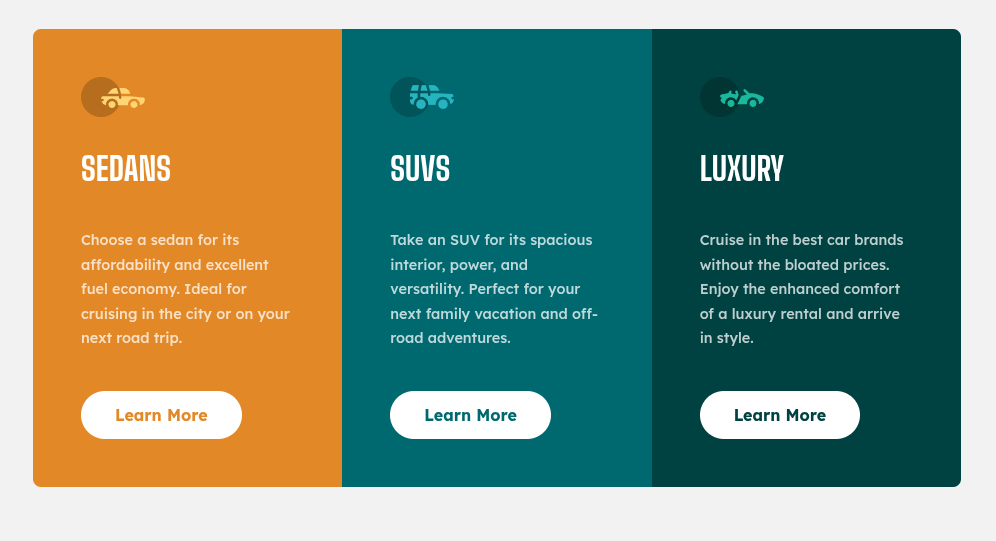

<h1 style="text-align:center">

Esta es mi solución para el desafío: 
[3-column preview card component challenge on Frontend Mentor](https://www.frontendmentor.io/challenges/3column-preview-card-component-pH92eAR2-)

</h1>

## Vista previa



## Vista general

El objetivo fue construir un componente responsive con tres tarjetas de vehículos.

La interfaz contiene:

- Sedans.
- SUVs.
- Luxury.
- Iconos decorativos.
- Texto descriptivo.
- Botones “Learn More”.
- Layout mobile-first.
- Tres columnas en escritorio.

## Enlaces

- Sitio publicado: [Ver proyecto en vivo](https://yovanidosh.github.io/FmSoLuTiOns/challenges/3-column-preview-card-component-main/)

## Lo que aprendí

En este proyecto aprendí a:

- Crear variantes de un mismo componente con BEM.
- Utilizar Flexbox dentro de cada tarjeta.
- Alinear botones con `margin-top: auto`.
- Construir un layout mobile-first.
- Pasar de una columna a tres columnas.
- Utilizar `minmax()` dentro de CSS Grid.
- Crear botones con estados `:hover`.
- Utilizar `:focus-visible`.
- Mantener iconos decorativos fuera del árbol accesible.
- Reutilizar una misma estructura con diferentes colores.

## Código destacado

### Botones alineados con Flexbox

```css
.vehicle-card {
  display: flex;
  flex-direction: column;
}

.vehicle-card__button {
  margin-top: auto;
}
```

Esta técnica permite mantener los botones alineados aunque cada tarjeta tenga una cantidad distinta de texto.

## Accesibilidad

El proyecto incluye:

- HTML semántico.
- Iconos decorativos con `alt=""`.
- `aria-hidden="true"`.
- Estados `:focus-visible`.
- Navegación mediante teclado.
- Mobile-first.
- Media Queries.

## Responsive Design

En móvil las tarjetas aparecen apiladas.

En pantallas mayores se muestran en tres columnas utilizando CSS Grid.

## Tecnologías utilizadas

- HTML5
- CSS3
- CSS Grid
- Flexbox
- BEM
- Media Queries
- Mobile-first

## Author

- Frontend Mentor: [JOHANX](https://www.frontendmentor.io/profile/YovaniDosh)