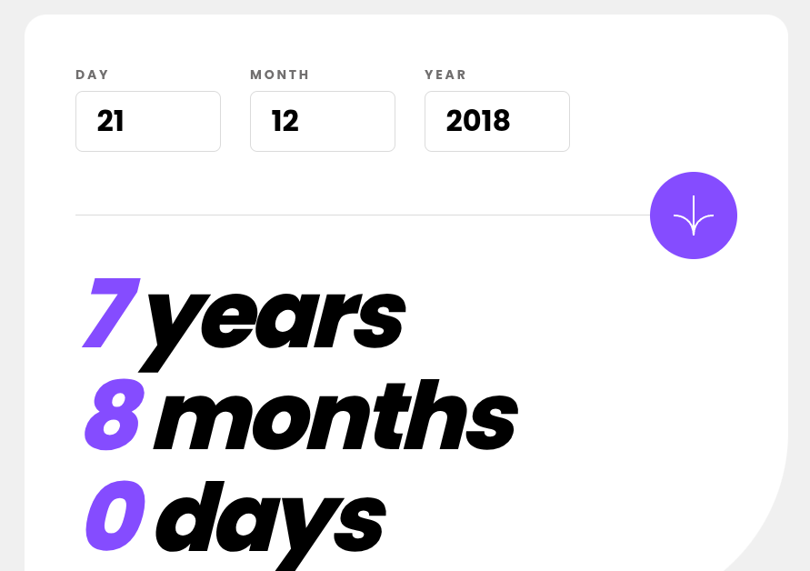

<h1 style="text-align:center">

Esta es mi solución para el reto [Age Calculator App.](https://www.frontendmentor.io/challenges/age-calculator-app-dF9DFFpj-Q)

</h1>

## Vista previa



## Link

[Ver proyecto](https://yovanidosh.github.io/FmSoLuTiOns/challenges/age-calculator-app-main/)

## Vista general

El objetivo fue construir una calculadora responsive que valide una fecha de nacimiento y muestre la edad exacta en años, meses y días.

La interfaz contiene:

- Campos numéricos para día, mes y año.
- Mensajes específicos para campos vacíos y fechas inválidas.
- Resultado actualizado al enviar una fecha válida.
- Diseño adaptable para móvil y escritorio.

## Tecnologías

- HTML5
- CSS3
- JavaScript
- Flexbox
- CSS Grid
- Media queries
- Propiedades personalizadas de CSS

## Lo que aprendí

- Validar fechas reales y no solo rangos numéricos.
- Calcular una edad considerando meses y días todavía no cumplidos.
- Asociar mensajes de error con sus campos mediante `aria-describedby`.
- Comunicar el resultado dinámico con una región `aria-live`.
- Gestionar el foco cuando el formulario contiene errores.

## Código destacado

```javascript
while (months < 11 && nextMonth <= today) {
  months += 1;
  monthCursor = nextMonth;
  nextMonth = createClampedDate(
    monthCursor.getFullYear(),
    monthCursor.getMonth() + 1,
    birthDate.getDate()
  );
}
```

El cálculo avanza por meses completos sin crear fechas inexistentes y después obtiene los días restantes.

## Accesibilidad

- Formulario semántico con etiquetas asociadas.
- Errores vinculados mediante `aria-describedby` y `aria-invalid`.
- Resultado dinámico anunciado mediante `aria-live`.
- Enfoque automático del primer campo inválido.
- Estados `:hover`, `:active` y `:focus-visible`.

## Responsive Design

En móvil, los campos comparten el ancho disponible y el botón queda centrado sobre el separador. En escritorio, la tarjeta amplía sus espacios, el botón se alinea a la derecha y el resultado aumenta de tamaño.

## Autor

- Frontend Mentor: [JOHANX](https://www.frontendmentor.io/profile/YovaniDosh)
