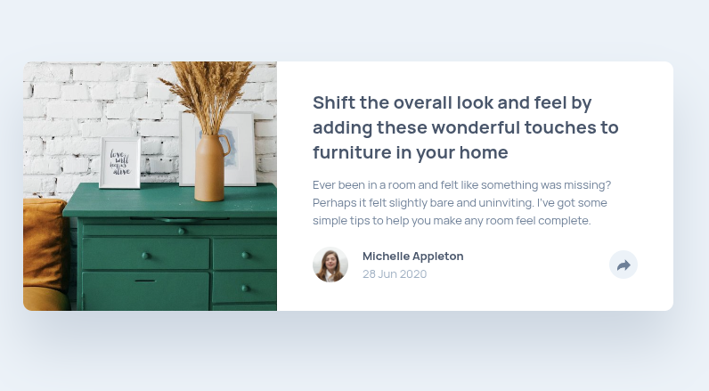

<h1 style="text-align:center">

Esta es mi solución para el reto [Article Preview Component.](https://www.frontendmentor.io/challenges/article-preview-component-dYBN_pYFT)

</h1>

## Vista previa



## Link

[Ver proyecto](https://yovanidosh.github.io/FmSoLuTiOns/challenges/article-preview-component-master/)

## Vista general

El objetivo fue construir una tarjeta responsive para presentar un artículo y mostrar enlaces sociales mediante un botón interactivo.

La interfaz contiene:

- Imagen principal del artículo.
- Título y descripción.
- Información de la autora y fecha de publicación.
- Botón para mostrar u ocultar las opciones de compartir.
- Enlaces a Facebook, Twitter y Pinterest.
- Diseño adaptable para dispositivos móviles y escritorio.

## Tecnologías

- HTML5
- CSS3
- JavaScript
- CSS Grid
- Flexbox
- Media queries
- Propiedades personalizadas de CSS
- SVG

## Lo que aprendí

En este proyecto aprendí a:

- Crear una tarjeta semántica mediante `<article>`.
- Utilizar `<time>` para representar una fecha de publicación.
- Comunicar el estado de un menú con `aria-expanded` y `aria-controls`.
- Cambiar la posición del panel de compartir según el ancho disponible.
- Cerrar una interfaz emergente al pulsar `Escape` o fuera de la tarjeta.
- Gestionar el foco después de cerrar el panel con el teclado.
- Combinar CSS Grid y Flexbox en un componente responsive.

## Código destacado

### Control del panel para compartir

```javascript
shareButton.addEventListener('click', () => {
  const isExpanded = shareButton.getAttribute('aria-expanded') === 'true';

  if (isExpanded) {
    closeShareMenu();
    return;
  }

  openShareMenu();
});
```

El botón consulta su estado accesible antes de decidir si debe abrir o cerrar el panel. Las funciones mantienen sincronizados el contenido visible, la etiqueta y `aria-expanded`.

## Accesibilidad

El proyecto incluye:

- HTML semántico.
- Texto alternativo útil para la imagen principal y el avatar.
- Botón nativo operable mediante teclado.
- Estado dinámico mediante `aria-expanded`.
- Relación con el panel mediante `aria-controls`.
- Nombres accesibles para los enlaces sociales.
- Estados `:focus-visible`.
- Cierre mediante la tecla `Escape` con recuperación del foco.

## Responsive Design

En dispositivos móviles:

- La imagen se muestra encima del contenido.
- El panel para compartir ocupa la zona inferior de la tarjeta.
- El contenido mantiene espacios adecuados desde 320 px.

En escritorio:

- La tarjeta utiliza dos columnas mediante CSS Grid.
- La imagen ocupa toda la altura de la primera columna.
- Las opciones de compartir aparecen como un panel flotante con indicador.

## Autor

- Frontend Mentor: [JOHANX](https://www.frontendmentor.io/profile/YovaniDosh)
