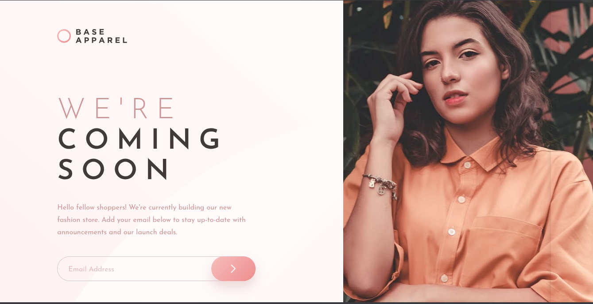

<h1 style="text-align:center">

Esta es mi solución para el desafío:
[Base Apparel Coming Soon Page](https://www.frontendmentor.io/challenges/base-apparel-coming-soon-page-5d4b587da5b2c9000d001264).

</h1>

## Vista previa



## Vista general

El objetivo fue construir una página de próximo lanzamiento completamente responsive con validación de correo electrónico.

La interfaz contiene:

- Logotipo de Base Apparel.
- Imágenes adaptativas para móvil y escritorio.
- Mensaje de próximo lanzamiento.
- Formulario de suscripción por correo electrónico.
- Validación para campos vacíos y correos incorrectos.
- Estado visual de error.
- Layout mobile-first.
- Composición de dos columnas para escritorio.

## Enlaces

- Sitio publicado: [Ver proyecto en vivo](https://yovanidosh.github.io/FmSoLuTiOns/challenges/base-apparel-coming-soon-master/)

## Lo que aprendí

En este proyecto aprendí a:

- Construir una landing page siguiendo una estrategia Mobile First.
- Utilizar `<picture>` para cargar imágenes diferentes según el ancho disponible.
- Combinar CSS Grid con una estructura semántica sencilla.
- Utilizar `clamp()` para crear tipografía fluida.
- Crear un campo visualmente integrado con su botón de envío.
- Consultar la API de validación nativa mediante `validity.valid`.
- Mostrar un mensaje de error con `aria-live`.
- Comunicar el estado incorrecto mediante `aria-invalid`.
- Devolver el foco al campo que requiere atención.
- Crear estados `hover`, `active` y `focus-visible` accesibles.
- Respetar `prefers-reduced-motion` en las transiciones.
- Aplicar nombres de clases siguiendo la metodología BEM.
- Cargar una fuente variable local mediante `@font-face`.

## Código destacado

### Validación accesible del correo

```javascript
if (!emailInput.validity.valid)
{
  showError();
  emailInput.focus();
  return;
}
```

La API de validación nativa comprueba si el campo está vacío o si el valor no tiene un formato de correo válido.

La función de error actualiza tanto la interfaz como el estado accesible del campo:

```javascript
function showError()
{
  form.classList.add("has-error");
  emailInput.setAttribute("aria-invalid", "true");
  errorMessage.textContent = "Please provide a valid email";
}
```

Esto mantiene sincronizados el borde rojo, el icono y el mensaje anunciado por las tecnologías de asistencia.

## Accesibilidad

El proyecto incluye:

- HTML semántico.
- Jerarquía correcta de encabezados.
- Etiqueta asociada al campo de correo.
- Mensajes dinámicos mediante `aria-live`.
- Uso de `aria-invalid` para comunicar errores.
- Nombres accesibles para el botón de envío.
- Textos alternativos útiles.
- Elementos decorativos ocultos con `aria-hidden`.
- Estados de foco visibles para teclado.
- Compatibilidad con `prefers-reduced-motion`.

## Responsive Design

El proyecto fue construido siguiendo una estrategia mobile-first.

En dispositivos móviles:

- El logotipo, la imagen, el contenido y el formulario se muestran en una columna.
- El contenido permanece centrado.
- La imagen móvil ocupa todo el ancho disponible.
- El formulario se adapta al ancho del contenedor.

En escritorio:

- El layout cambia a una cuadrícula de dos columnas.
- El contenido se muestra sobre un patrón de fondo decorativo.
- La imagen de escritorio ocupa toda la altura de la segunda columna.
- El texto y el formulario se alinean a la izquierda.

## Author

- Frontend Mentor: [JOHANX](https://www.frontendmentor.io/profile/YovaniDosh)
