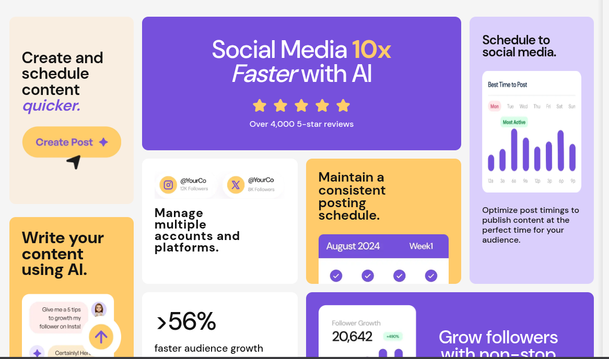

<h1 style= "text-align:center">

Esta es mi solución para el desafío :
[Bento/Grip/Page](https://www.frontendmentor.io/challenges/blog-preview-card-ckPaj01IcS).

</h1>

## Vista previa



## Vista general

El objetivo fue construir un layout tipo Bento Grid completamente responsive.

La interfaz contiene:

- Ocho tarjetas con diferentes tamaños y proporciones.
- Contenido social y estadísticas.
- Tarjetas distribuidas en distintas filas y columnas.
- Imágenes que se adaptan o desbordan intencionalmente.
- Layout mobile-first.
- Reorganización completa para escritorio.

## Enlaces

- Sitio publicado: [Ver proyecto en vivo](https://yovanidosh.github.io/FmSoLuTiOns/challenges/bento-grid-main/)

## Lo que aprendí

En este proyecto aprendí a:

- Construir un layout Bento utilizando CSS Grid.
- Utilizar `grid-template-areas`.
- Asignar posiciones mediante `grid-area`.
- Crear cards que ocupan más de una columna.
- Crear cards que ocupan más de una fila.
- Utilizar `minmax()` para controlar tamaños flexibles.
- Reorganizar completamente un layout sin cambiar el HTML.
- Diseñar primero una versión móvil de una sola columna.
- Transformar el layout en una composición compleja para escritorio.
- Comparar la sintaxis de variables Sass y Less.
- Separar estilos mediante partials.
- Usar nesting de forma controlada.
- Utilizar `clamp()` para tipografías fluidas.
- Utilizar `aspect-ratio`.
- Controlar imágenes que exceden intencionalmente su contenedor.
- Usar `max-width: none`.
- Recortar contenido mediante `overflow: hidden`.
- Mantener una estructura BEM consistente.
- Evitar modificar el orden semántico del HTML solamente por razones visuales.
- Utilizar npm para compilar Sass.

## Código destacado

### Grid Areas

```scss
.bento {
  grid-template-areas:
    "create social social timing"
    "create accounts schedule timing"
    "ai audience growth growth";
}
```

Cada nombre representa una zona del grid.

Posteriormente cada tarjeta se asigna a su región:

```scss
.card--social {
  grid-area: social;
}

.card--timing {
  grid-area: timing;
}
```

Esto permite visualizar la estructura del layout directamente desde el CSS.


## Accesibilidad

El proyecto incluye:

- HTML semántico.
- Uso de `<main>` y `<article>`.
- Imágenes decorativas con `aria-hidden`.
- Jerarquía de encabezados.
- Mobile-first.
- Responsive Design.
- BEM.
- Sass.
- CSS Grid.
- Media Queries.
- npm.

## Responsive Design

El proyecto fue construido siguiendo una estrategia mobile-first.

En dispositivos móviles:

- Todas las cards se muestran en una única columna.
- Cada elemento conserva una lectura natural.
- Las imágenes se adaptan al espacio disponible.

En escritorio:

- El layout cambia a una cuadrícula Bento.
- Algunas tarjetas ocupan varias columnas.
- `grid-template-areas` controla la composición general.
- Las imágenes mantienen las proporciones definidas por el diseño.

## Author

- Frontend Mentor: [JOHANX](https://www.frontendmentor.io/profile/YovaniDosh)