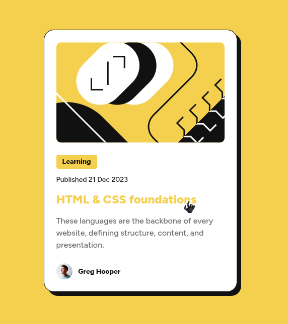

# Frontend Mentor - Blog Preview Card

Esta es mi solución para el reto [Blog Preview Card](https://www.frontendmentor.io/challenges/blog-preview-card-ckPaj01IcS).

## Vista previa

## Enlaces

- Sitio publicado: [Ver proyecto en vivo](https://yovanidosh.github.io/FmSoLuTiOns/challenges/blog-preview-card/)

## Tecnologías utilizadas

- HTML5 semántico
- CSS
- Flexbox
- Variables Css
- Propiedades personalizadas de CSS
- Diseño mobile-first
- Responsive design
- Metodoloia BEM

## Lo que aprendí

- Organizar clases con la metodología BEM.
- Separar un componente en bloque y elementos.
- Crear una sombra sólida desplazada.
- Aplicar estados interactivos con `:hover`.
- Usar una fuente variable local.
- Construir un componente mobile-first.

## Autor

- Frontend Mentor: [JOHANX](https://www.frontendmentor.io/profile/YovaniDosh)
