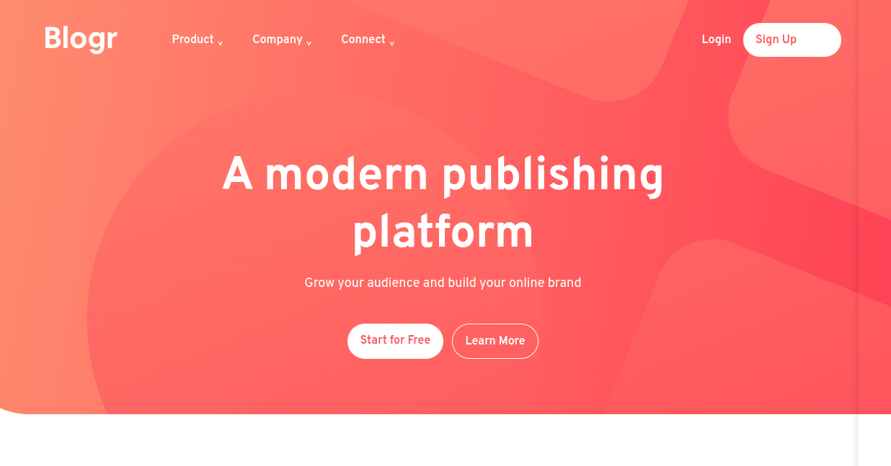

<div align="center">

# Blogr Landing Page



</div>

## Vista general

Landing page responsive para una plataforma de publicación, con navegación desplegable, hero, secciones de producto e infraestructura y footer multicolumna.

## Enlaces

- [Demostración en vivo](https://yovanidosh.github.io/FmSoLuTiOns/challenges/blogr-landing-page-main/)
- [Código fuente](https://github.com/YovaniDosh/FmSoLuTiOns/tree/main/challenges/blogr-landing-page-main)

## Lo que aprendí

- Coordinar menús móviles y desplegables mediante `aria-expanded`.
- Evitar que enlaces ocultos reciban foco utilizando `inert`.
- Crear composiciones responsive con Grid e imágenes adaptativas.
- Organizar selectores y variantes con nesting de Sass.

```js
function setMenu(open)
{
  menuToggle.setAttribute("aria-expanded", String(open));
  menu.toggleAttribute("inert", !open && !desktopMedia.matches);
}
```

## Accesibilidad

La navegación utiliza botones nativos, nombres accesibles, foco visible, cierre con `Escape` y estados sincronizados mediante `aria-expanded` e `inert`.

## Responsive Design

El diseño comienza con contenido apilado y menú modal en móvil. En escritorio utiliza navegación horizontal, desplegables y composiciones de dos columnas.

## Tecnologías utilizadas

- HTML5 semántico
- Sass, CSS Grid y Flexbox
- JavaScript
- npm
- Fuente variable local Overpass

## Autor

- GitHub: [@YovaniDosh](https://github.com/YovaniDosh)
- Frontend Mentor: [@YovaniDosh](https://www.frontendmentor.io/profile/YovaniDosh)
