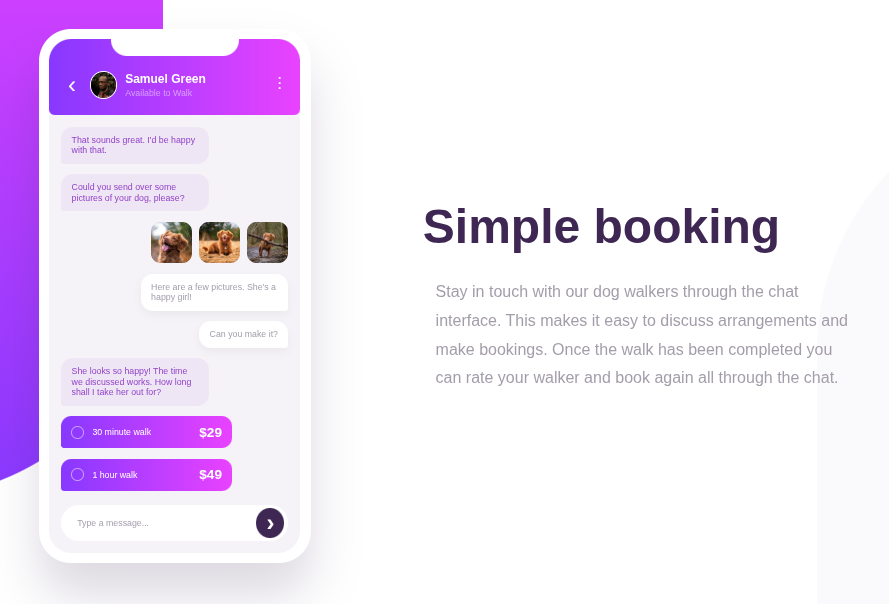

<h1 style="text-align:center">

Esta es mi solución para el desafío: [Chat app CSS illustration challenge on Frontend Mentor](https://www.frontendmentor.io/challenges/chat-app-css-illustration-O5auMkFqY)

</h1>

## Vista previa



## Vista general

El objetivo fue construir una landing responsive que representa una aplicación móvil de chat.

El proyecto incluye:

- Interfaz de teléfono creada con HTML y CSS.
- Conversación con mensajes enviados y recibidos.
- Galería de imágenes.
- Opciones de paseo.
- Gradientes y formas decorativas.
- Diseño responsive.

## Enlaces

- Sitio publicado: [Ver proyecto en vivo](https://yovanidosh.github.io/FmSoLuTiOns/challenges/chat-app-css-illustration-master/)

## Lo que aprendí

En este proyecto aprendí a:

- Construir una interfaz móvil dentro de una landing page.
- Combinar CSS Grid y Flexbox.
- Posicionar mensajes con `align-self`.
- Crear formas decorativas con CSS.
- Trabajar con gradientes.
- Usar `aspect-ratio` en imágenes y elementos circulares.
- Controlar elementos decorativos con `position: absolute`.
- Adaptar una composición compleja con Media Queries.
- Mantener una estrategia mobile-first.

## Código destacado

```css
.message--received {
  align-self: flex-start;
}

.message--sent {
  align-self: flex-end;
}

.walk-option {
  background:
    linear-gradient(
      to right,
      var(--color-gradient-start),
      var(--color-gradient-end)
    );
}
```

Con `align-self` pude posicionar individualmente los mensajes dentro del contenedor Flexbox, creando visualmente una conversación.

## Accesibilidad

El proyecto incluye:

- HTML semántico.
- Texto alternativo en imágenes relevantes.
- Elementos decorativos ocultos para lectores de pantalla.
- Botones con `aria-label`.
- Jerarquía de encabezados.

## Responsive Design

El proyecto sigue una estrategia mobile-first.

En móvil el teléfono y el contenido aparecen verticalmente. En escritorio la composición cambia a dos columnas mediante CSS Grid.

## Tecnologías utilizadas

- HTML5
- CSS3
- Flexbox
- CSS Grid
- CSS Custom Properties
- Media Queries
- Mobile-first

## Author

- Frontend Mentor: [JOHANX](https://www.frontendmentor.io/profile/YovaniDosh)