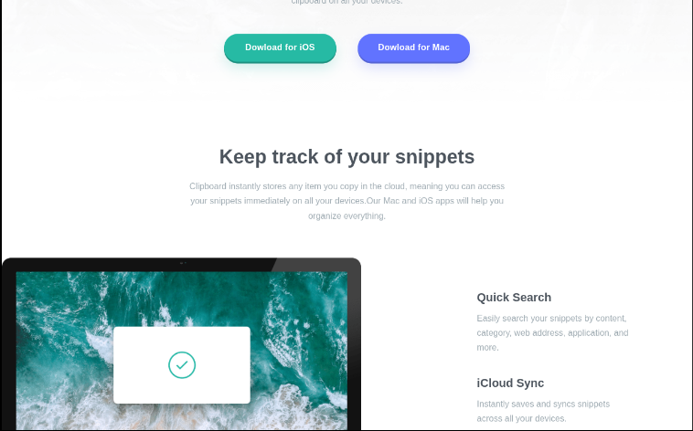

<h1 style = "text-align:center">

Esta es mi solución para el desafío: [Clipboard landing page challenge on Frontend Mentor](https://www.frontendmentor.io/challenges/clipboard-landing-page-82y9qDgXD).

</h1>

## Vista previa



## Vista general

El objetivo fue construir una landing page responsive para una aplicación de portapapeles.

La página contiene:

- Hero principal.
- Botones de descarga para iOS y Mac.
- Sección de seguimiento de snippets.
- Imagen de escritorio.
- Lista de funcionalidades.
- Sección de acceso multidispositivo.
- Workflow de productividad.
- Logos de empresas.
- CTA final.
- Footer con navegación y redes sociales.

## Enlaces

- Sitio publicado: [Ver proyecto en vivo](https://yovanidosh.github.io/FmSoLuTiOns/challenges/clipboard-landing-page-master/)

## Lo que aprendí

En este proyecto aprendí a:

- Continuar trabajando con Less mediante npm.
- Organizar una landing page grande con estilos separados.
- Crear variables reutilizables con `@`.
- Utilizar `@import` en Less.
- Crear mixins.
- Reutilizar patrones mediante mixins.
- Utilizar nesting en componentes y secciones.
- Crear funciones visuales con `fade()`.
- Construir una landing page siguiendo mobile-first.
- Crear un sistema de botones reutilizable dentro del mismo proyecto.
- Diseñar secciones completas con CSS Grid.
- Cambiar layouts de una a varias columnas.
- Permitir que una imagen rompa parcialmente el contenedor.
- Utilizar `transform: translateX()`.
- Construir una sección de logos responsive.
- Crear un footer responsive.
- Evitar media queries innecesarias.
- Mantener jerarquía semántica con `<header>`, `<main>`, `<section>`, `<article>` y `<footer>`.
- Crear estados `:hover`, `:focus-visible` y `:active`.
- Mantener accesibilidad en enlaces e iconos decorativos.

## Código destacado

### Mixin de contenedor

```less
.section-container() {
  width: min(100% - 2rem, 70rem);
  margin-inline: auto;
}
```

Luego puede reutilizarse:

```less
.section {
  .section-container();
}
```

Esto evita repetir las mismas reglas en todas las secciones.

### Transparencia con Less

```less
box-shadow:
  0 0.75rem 1.5rem
  fade(@color-green, 20%);
```

`fade()` permite generar una versión transparente de un color ya declarado.

### Layout responsive

```less
@media (min-width: @breakpoint-tablet) {
  .workflow {
    grid-template-columns:
      repeat(3, minmax(0, 1fr));
  }
}
```

La página comienza con una columna y cambia a tres columnas cuando existe suficiente espacio.

## Accesibilidad

El proyecto incluye:

- HTML semántico.
- Texto alternativo descriptivo.
- Iconos decorativos con `aria-hidden`.
- Navegación mediante teclado.
- Estados `:focus-visible`.
- Enlaces reales mediante `<a>`.
- `aria-label` en redes sociales.
- Mobile-first.
- Responsive Design.
- Less.
- CSS Grid.
- Flexbox.
- Media Queries.
- npm.

## Responsive Design

El proyecto fue construido siguiendo una estrategia mobile-first.

En dispositivos móviles:

- Los botones aparecen apilados.
- Las secciones se presentan en una sola columna.
- Las funcionalidades aparecen centradas.
- Los logos se muestran verticalmente.
- El footer se organiza en columna.

En pantallas mayores:

- Los botones aparecen en fila.
- Keep Track se convierte en dos columnas.
- La imagen del ordenador sobresale ligeramente del contenedor.
- Workflow utiliza tres columnas.
- Los logos aparecen horizontalmente.
- El footer cambia a una distribución horizontal.

## Author

- Frontend Mentor: [JOHANX](https://www.frontendmentor.io/profile/YovaniDosh)