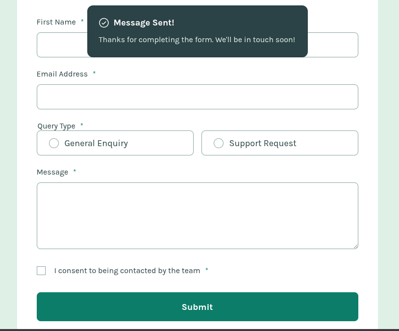

<h1 style="text-align:center">

Esta es mi solución para el reto [Contact Form.](https://www.frontendmentor.io/challenges/contact-form--G-hYlqKJj)

</h1>

## Vista previa



## Link

Demo preparada para GitHub Pages: [Ver proyecto](https://yovanidosh.github.io/FmSoLuTiOns/challenges/contact-form-main/)

## Vista general

El objetivo fue construir un formulario de contacto responsive con validación accesible, controles personalizados y confirmación de envío.

La interfaz contiene:

- Campos para nombre, apellido y correo electrónico.
- Dos tipos de consulta con selección única.
- Área para escribir el mensaje.
- Consentimiento obligatorio mediante checkbox.
- Mensajes específicos para cada error.
- Aviso de confirmación después de un envío válido.

## Tecnologías

- HTML5
- CSS3
- JavaScript
- CSS Grid
- Flexbox
- Validación de formularios
- Fuente variable local

## Lo que aprendí

En este proyecto aprendí a:

- Construir un formulario mediante controles nativos.
- Agrupar opciones relacionadas con `fieldset` y `legend`.
- Relacionar errores con campos mediante `aria-describedby`.
- Comunicar campos inválidos mediante `aria-invalid`.
- Diferenciar un correo vacío de un formato de correo incorrecto.
- Enfocar el primer campo inválido después del envío.
- Personalizar radio buttons y checkboxes sin perder su uso con teclado.
- Comunicar el envío correcto mediante una región `role="status"`.

## Código destacado

### Validación y enfoque del primer error

```javascript
const textResults = textFields.map(validateTextField);
const isQueryValid = validateQueryType();
const isConsentValid = validateConsent();
const isFormValid = textResults.every(Boolean) && isQueryValid && isConsentValid;

if (!isFormValid) {
  contactForm.querySelector('[aria-invalid="true"]').focus();
  return;
}
```

Cada grupo devuelve un resultado booleano. Si existe algún error, el foco se mueve al primer control inválido para que el usuario pueda corregirlo sin tener que buscarlo visualmente.

## Accesibilidad

El proyecto incluye:

- Etiquetas asociadas explícitamente a los campos.
- Atributos `autocomplete` para datos personales.
- Opciones agrupadas mediante `fieldset` y `legend`.
- Errores vinculados mediante `aria-describedby`.
- Estado inválido comunicado mediante `aria-invalid`.
- Navegación completa con teclado.
- Estados de foco visibles.
- Confirmación anunciada mediante `role="status"`.
- Controles nativos conservados bajo la personalización visual.
- Compatibilidad con `prefers-reduced-motion`.

## Responsive Design

En dispositivos móviles:

- Todos los campos se organizan en una columna.
- Las opciones de consulta se apilan verticalmente.
- El área de mensaje aumenta su altura para facilitar la escritura.

En tablet y escritorio:

- Nombre y apellido comparten una fila.
- Las opciones de consulta se muestran en dos columnas.
- El formulario mantiene un ancho máximo y permanece centrado.
- El área de mensaje utiliza una altura más compacta.

## Autor

- Frontend Mentor: [JOHANX](https://www.frontendmentor.io/profile/YovaniDosh)
