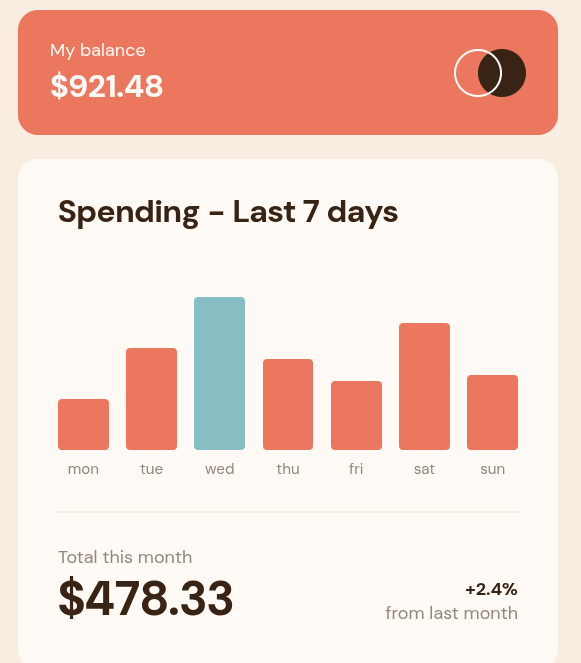

<h1 style="text-align:center">

Esta es mi solución para el reto [Expenses Chart Component.](https://www.frontendmentor.io/challenges/expenses-chart-component-e7yJBUdjwt)

</h1>

## Vista previa



## Link

[Ver proyecto](https://yovanidosh.github.io/FmSoLuTiOns/challenges/expenses-chart-component-main/)

## Vista general

El objetivo fue construir un componente responsive que representa los gastos de los últimos siete días a partir de un archivo JSON local.

La interfaz contiene:

- Tarjeta con el balance disponible.
- Gráfico de barras generado dinámicamente.
- Tooltip con el importe de cada día.
- Resumen del gasto mensual y comparación con el mes anterior.

## Tecnologías

- HTML5
- Less
- CSS3 compilado
- JavaScript
- Fetch API
- CSS Grid
- Flexbox

## Lo que aprendí

- Consumir datos locales mediante `fetch`.
- Normalizar valores para convertirlos en alturas proporcionales.
- Utilizar nesting y variables en Less sin ocultar la estructura del CSS.
- Hacer accesible un gráfico interactivo mediante botones y nombres descriptivos.
- Mostrar tooltips tanto con puntero como con navegación por teclado.

## Código destacado

```javascript
const height = (amount / highestAmount) * 100;

bar.style.setProperty("--bar-height", `${height}%`);
bar.setAttribute("aria-label", `${dayNames[day]}: $${amount.toFixed(2)}`);
```

Cada importe se compara con el valor más alto para calcular una altura proporcional. El mismo botón comunica el día y el importe a las tecnologías de asistencia.

## Accesibilidad

- HTML semántico con encabezados y lista para los datos.
- Barras operables mediante teclado.
- Nombres accesibles con el día y el importe completo.
- Estado de carga y error comunicado mediante `role="status"`.
- Estados `:hover` y `:focus-visible` equivalentes.
- Compatibilidad con `prefers-reduced-motion`.

## Responsive Design

En móvil, las barras y textos reducen su escala para conservar las siete columnas desde 320 px. En escritorio, las tarjetas amplían sus espacios, el gráfico gana altura y los totales aumentan de tamaño.

## Autor

- Frontend Mentor: [JOHANX](https://www.frontendmentor.io/profile/YovaniDosh)
