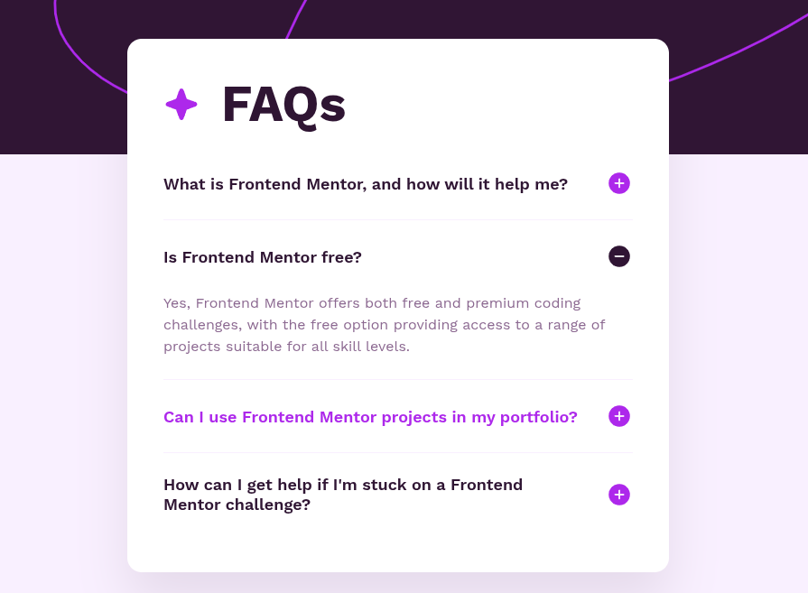

<h1 style="text-align:center">

Esta es mi solución para el reto [FAQ Accordion.](https://www.frontendmentor.io/challenges/faq-accordion-wyfFdeBwBz)

</h1>

## Vista previa



## Link

Demo preparada para GitHub Pages: [Ver proyecto](https://yovanidosh.github.io/FmSoLuTiOns/challenges/faq-accordion/)

## Vista general

El objetivo fue construir un acordeón de preguntas frecuentes responsive, accesible y operable con teclado.

La interfaz contiene:

- Cuatro preguntas frecuentes.
- Respuestas que se muestran y ocultan de forma interactiva.
- Iconos que indican el estado abierto o cerrado.
- Una sola respuesta abierta a la vez.
- Diseño adaptable para dispositivos móviles y escritorio.

## Tecnologías

- HTML5
- CSS3
- JavaScript
- Flexbox
- Media queries
- Propiedades personalizadas de CSS
- SVG

## Lo que aprendí

En este proyecto aprendí a:

- Construir un acordeón con botones nativos.
- Relacionar preguntas y respuestas mediante `aria-controls`.
- Comunicar el estado de cada pregunta con `aria-expanded`.
- Identificar el botón pulsado mediante `closest()`.
- Recorrer los botones para mantener una sola respuesta abierta.
- Cambiar iconos según el estado del componente.
- Crear un fondo responsive con imágenes diferentes para móvil y escritorio.
- Mantener estados `hover` y `focus-visible` accesibles.

## Código destacado

### Control del acordeón

```javascript
accordion.addEventListener('click', (event) => {
  const selectedButton = event.target.closest('.accordion__button');

  if (!selectedButton) {
    return;
  }

  const isExpanded = selectedButton.getAttribute('aria-expanded') === 'true';

  accordionButtons.forEach((button) => {
    if (button !== selectedButton) {
      closeItem(button);
    }
  });

  isExpanded ? closeItem(selectedButton) : openItem(selectedButton);
});
```

La delegación de eventos permite controlar todas las preguntas desde un único listener. Antes de abrir una respuesta se cierran las demás para mantener el componente ordenado.

## Accesibilidad

El proyecto incluye:

- HTML semántico con encabezados para cada pregunta.
- Botones nativos operables con teclado.
- Relaciones entre botones y paneles mediante `aria-controls` y `aria-labelledby`.
- Estado dinámico mediante `aria-expanded`.
- Regiones identificadas para cada respuesta.
- Estados de foco visibles.
- Iconos decorativos con texto alternativo vacío.

## Responsive Design

En dispositivos móviles:

- La tarjeta utiliza casi todo el ancho disponible.
- Los espacios y encabezados se adaptan a pantallas pequeñas.
- Se utiliza la ilustración de fondo móvil.

En escritorio:

- La tarjeta mantiene un ancho máximo y permanece centrada.
- Aumentan el espacio interior y los tamaños tipográficos.
- Se utiliza la ilustración de fondo de escritorio.

## Autor

- Frontend Mentor: [JOHANX](https://www.frontendmentor.io/profile/YovaniDosh)
