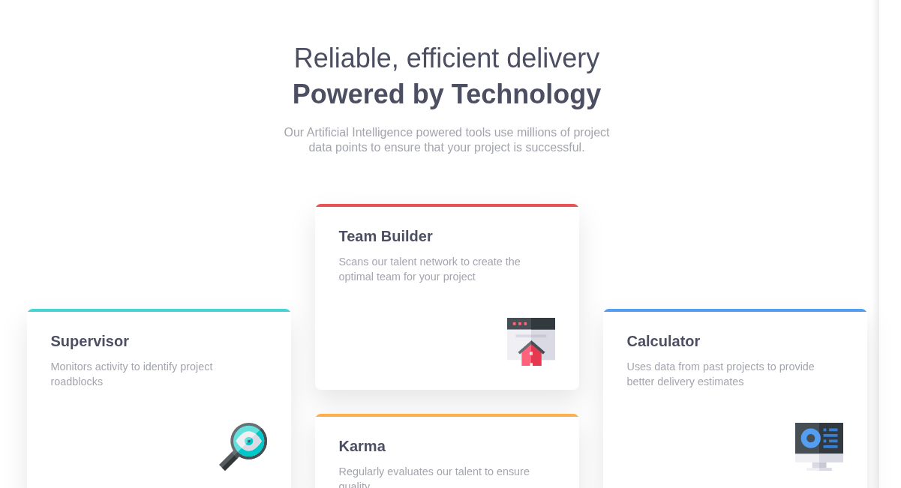

<h1 style = "text-align:center">

Esta es mi solución para el desafío: [Four card feature section challenge on Frontend Mentor](https://www.frontendmentor.io/challenges/four-card-feature-section-weK1eFYK).

</h1>

## Vista previa



## Vista general

El objetivo de este proyecto fue construir una sección de características formada por cuatro tarjetas y reproducir su distribución responsive utilizando HTML semántico y CSS.

La interfaz contiene:

- Encabezado principal con descripción.
- Iconos decorativos para cada característica.
- Líneas superiores con diferentes colores.
- Layout responsive.
- Composición asimétrica en escritorio.

## Enlaces

- Sitio publicado: [Ver proyecto en vivo](https://yovanidosh.github.io/FmSoLuTiOns/challenges/four-card-feature-section-master/)

## Lo que aprendí

En este proyecto aprendí a:

- Construir layouts utilizando **CSS Grid**.
- Posicionar elementos mediante `grid-column`.
- Posicionar elementos mediante `grid-row`.
- Crear una composición asimétrica sin modificar la estructura HTML.
- Combinar **CSS Grid y Flexbox** dentro de una misma interfaz.
- Utilizar Grid para controlar la posición de los componentes.
- Utilizar Flexbox para organizar el contenido interno de cada tarjeta.
- Empujar elementos hacia el final de un contenedor con `margin-top: auto`.
- Crear elementos decorativos utilizando pseudo-elementos.
- Utilizar `::before` para generar las líneas superiores de las tarjetas.
- Crear variantes de un mismo componente mediante modificadores BEM.
- Construir primero la interfaz móvil y ampliarla progresivamente.
- Adaptar una misma estructura HTML a diferentes distribuciones según el tamaño de pantalla.
- Limitar el ancho del contenido utilizando `min()`.

## Código destacado

### Composición asimétrica con CSS Grid

Uno de los principales aprendizajes del proyecto fue posicionar las cuatro tarjetas utilizando filas y columnas explícitas.

```css
@media (min-width: 64rem) 
{
  .features 
  {
    grid-template-columns:
      repeat(3, minmax(0, 1fr));

    grid-template-rows:
      repeat(4, 1fr);

    grid-template-areas:
      ".          team       ."
      "supervisor team       calculator"
      "supervisor karma      calculator"
      ".          karma      .";
  }
}

```

Esto permite conseguir la composición del diseño en escritorio:

```text
                Team Builder

Supervisor                     Calculator

                    Karma
```

sin cambiar el orden ni duplicar elementos en el HTML.

### Decoración mediante pseudo-elementos

Las líneas superiores de las tarjetas fueron creadas con `::before`.

```css
.feature-card::before 
{
  content: "";

  position: absolute;

  top: 0;
  left: 0;

  width: 100%;
  height: 0.25rem;
}
```

Después, cada modificador BEM define únicamente su color:

```css
.feature-card--supervisor::before {
  background: var(--color-cyan);
}

.feature-card--team::before {
  background: var(--color-red);
}

.feature-card--karma::before {
  background: var(--color-orange);
}

.feature-card--calculator::before {
  background: var(--color-blue);
}
```

De esta manera se evita añadir elementos HTML cuya única función sería decorativa.

### Grid + Flexbox

Cada tarjeta utiliza Flexbox internamente:

```css
.feature-card 
{
  display: flex;
  flex-direction: column;
}
```

Mientras que el conjunto de tarjetas utiliza Grid:

```css
.features 
{
  display: grid;
}
```

Esto me permitió comprender mejor cuándo utilizar cada herramienta:

- **CSS Grid** para controlar la estructura general.
- **Flexbox** para distribuir contenido dentro de un componente.

### Posicionar el icono con `margin-top: auto`

```css
.feature-card img {
  width: 4rem;

  margin-top: auto;
  margin-left: auto;
}
```

Al estar dentro de un contenedor Flexbox, `margin-top: auto` utiliza el espacio disponible y empuja el icono hacia la parte inferior de la tarjeta.

## Accesibilidad

El proyecto incluye:

- HTML semántico.
- Jerarquía correcta de encabezados.
- Sección identificada mediante `aria-label`.
- Iconos decorativos con `alt=""`.
- Iconos decorativos con `aria-hidden="true"`.
- Separación entre contenido y elementos puramente visuales.
- Soporte para `prefers-reduced-motion`.

Los iconos no aportan información adicional al contenido, por lo que se ocultan correctamente de los lectores de pantalla:

```html

```

## Responsive Design

El proyecto fue desarrollado siguiendo una estrategia **mobile-first**.

### Mobile

Las cuatro tarjetas se muestran verticalmente:

```text
Supervisor
    ↓
Team Builder
    ↓
Karma
    ↓
Calculator
```

Esto mantiene un flujo de lectura sencillo en pantallas pequeñas.

### Tablet

El layout evoluciona a una distribución de dos columnas para aprovechar mejor el espacio disponible.

### Desktop

CSS Grid reorganiza las tarjetas para reproducir la composición asimétrica del diseño original:

```text
                    Team Builder

    Supervisor                      Calculator

                        Karma
```

Las tarjetas laterales quedan centradas verticalmente respecto a las dos tarjetas centrales.

## Tecnologías utilizadas

- HTML5
- CSS3
- CSS Custom Properties
- CSS Grid
- Flexbox
- BEM
- Media Queries
- Mobile-first

## Author

- Frontend Mentor: [JOHANX](https://www.frontendmentor.io/profile/YovaniDosh)