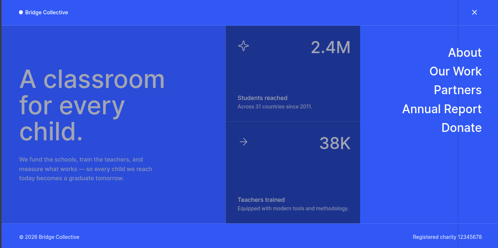

<h1 style="text-align:center">

Esta es mi solución para el desafío: Bridge Collective challenge on Frontend Mentor

</h1>

## Vista previa



## Vista general

El objetivo fue construir una landing responsive de impacto social con estadísticas y un menú interactivo.

El proyecto contiene:

- Hero principal.
- Cuatro estadísticas.
- Menú responsive.
- Overlay al abrir navegación.
- Iconos personalizados para abrir y cerrar.
- Diseño mobile-first.

## Enlaces

- Sitio publicado: [Ver proyecto en vivo](https://yovanidosh.github.io/FmSoLuTiOns/challenges/grid-landing-page-main/)

## Lo que aprendí

En este proyecto aprendí a:

- Controlar estados visuales desde JavaScript.
- Cambiar iconos dinámicamente.
- Actualizar `aria-expanded`.
- Cerrar menús con la tecla `Escape`.
- Crear overlays interactivos.
- Combinar CSS Grid y Flexbox.
- Construir layouts distintos entre móvil y desktop.
- Organizar estadísticas responsive.
- Mantener una estrategia mobile-first.

## Código destacado

```js
function updateMenuState(isOpen)
{
  document.body.classList.toggle("menu-open", isOpen);

  menuButton.setAttribute("aria-expanded", String(isOpen));
  menuButton.setAttribute(
    "aria-label",
    isOpen ? "Close navigation" : "Open navigation"
  );

  menuIcon.src = isOpen ? CLOSE_ICON : MENU_ICON;
}
```

Esta función centraliza el estado del menú y mantiene sincronizados CSS, accesibilidad e iconos.

## Accesibilidad

El proyecto incluye:

- HTML semántico.
- Botón de menú accesible.
- `aria-expanded`.
- `aria-controls`.
- `aria-label`.
- Cierre mediante teclado con `Escape`.

## Responsive Design

En móvil el contenido se apila verticalmente.

En escritorio la interfaz cambia a una composición de dos columnas con estadísticas organizadas en Grid y un panel lateral para la navegación.

## Tecnologías utilizadas

- HTML5
- CSS3
- JavaScript
- CSS Grid
- Flexbox
- CSS Custom Properties
- Media Queries
- Mobile-first

## Author

- Frontend Mentor: [JOHANX](https://www.frontendmentor.io/profile/YovaniDosh)