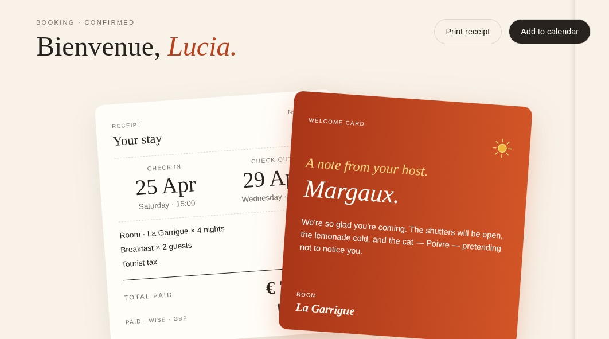

# Booking confirmation dashboard solution

Esta es mi solución para el desafío Booking Confirmation Dashboard: [Hote/Confirmation/Card/Page](https://www.frontendmentor.io/challenges/hotel-booking-confirmation-page).


## Vista previa



## Vista general

El objetivo fue construir un dashboard responsive de confirmación de reserva.

La interfaz contiene:

- Sidebar responsive.
- Navegación móvil.
- Información general de la reserva.
- Receipt de estadía.
- Welcome Card.
- Efecto interactivo “Hover to fan”.
- Información de llegada.
- Credenciales WiFi.
- Información del desayuno.
- Función para copiar la contraseña WiFi.
- Estados hover, focus y active.

## Enlaces

- Sitio publicado: [Ver proyecto en vivo](https://yovanidosh.github.io/FmSoLuTiOns/challenges/hotel-booking-confirmation-page-main/)

## Lo que aprendí

En este proyecto aprendí a:

- Construir un dashboard completo siguiendo una estrategia mobile-first.
- Crear un sidebar responsive.
- Transformar el sidebar en un menú móvil.
- Controlar un menú mediante JavaScript.
- Sincronizar el estado visual del menú con `aria-expanded`.
- Organizar Sass utilizando partials.
- Utilizar `@use` para separar responsabilidades.
- Crear variables Sass reutilizables.
- Aplicar nesting de forma controlada.
- Construir layouts complejos con CSS Grid.
- Utilizar `position: sticky`.
- Superponer elementos mediante `position` y `z-index`.
- Aplicar `transform: rotate()` y `translate()`.
- Crear una interacción “Hover to fan”.
- Utilizar `:has()` para reaccionar al estado de un elemento descendiente.
- Crear transiciones suaves.
- Respetar `prefers-reduced-motion`.
- Utilizar `<dl>`, `<dt>` y `<dd>` para información relacionada.
- Utilizar la Clipboard API.
- Trabajar con funciones `async`.
- Manejar errores mediante `try...catch`.
- Crear feedback visual mediante JavaScript.
- Utilizar `setTimeout()`.
- Crear contenido accesible con `.visually-hidden`.
- Utilizar `aria-live` para anunciar cambios dinámicos.
- Aplicar BEM de manera más consistente.
- Refactorizar código eliminando clases genéricas y duplicación.
- Separar responsabilidades entre HTML, Sass y JavaScript.
- Compilar Sass utilizando npm.

## Código destacado

### Hover to fan

```scss
.booking {
  &:has(.booking__fan-trigger:hover),
  &:has(.booking__fan-trigger:focus-visible) {
    .receipt {
      transform:
        translateX(-5rem)
        rotate(-8deg);
    }

    .welcome-card {
      transform:
        translateX(5rem)
        rotate(8deg);
    }

    .booking__sun {
      opacity: 1;

      transform:
        translate(-50%, -50%)
        scale(1);
    }
  }
}
```

Esta técnica permite modificar las dos tarjetas al interactuar con el botón situado entre ellas.

### Clipboard API

```js
async function copyWifiPassword() {
  const password = wifiPassword.textContent.trim();

  try {
    await navigator.clipboard.writeText(password);

    copyPasswordButton.textContent = "Copied!";
    copyPasswordButton.disabled = true;

    copyStatus.textContent =
      "WiFi password copied to clipboard.";

  } catch (error) {
    console.error(
      "Unable to copy WiFi password:",
      error
    );
  }
}
```

### Menú móvil accesible

```js
function updateMenuButton(isOpen) {
  menuButton.setAttribute(
    "aria-expanded",
    String(isOpen)
  );

  menuButton.setAttribute(
    "aria-label",
    isOpen
      ? "Close navigation"
      : "Open navigation"
  );

  menuButton.querySelector("span").textContent =
    isOpen ? "×" : "☰";
}
```

## Accesibilidad

El proyecto incluye:

- HTML semántico.
- Navegación mediante teclado.
- `aria-expanded`.
- `aria-controls`.
- `aria-label`.
- `aria-live`.
- `.visually-hidden`.
- `aria-current`.
- Iconos decorativos con `aria-hidden`.
- Estados `:focus-visible`.
- Soporte para `prefers-reduced-motion`.
- Mobile-first.
- Responsive Design.
- BEM.
- Sass.
- JavaScript.
- CSS Grid.
- Flexbox.
- Media Queries.
- npm.

## Responsive Design

El proyecto fue construido siguiendo una estrategia mobile-first.

En dispositivos móviles:

- El sidebar se transforma en una barra superior.
- La navegación se abre mediante un menú.
- Welcome Card aparece antes del Receipt.
- Las tarjetas informativas se muestran verticalmente.

En escritorio:

- El sidebar permanece visible.
- Receipt y Welcome Card aparecen superpuestos.
- El efecto Hover to fan separa ambas tarjetas.
- Las tarjetas Arrival, WiFi y Breakfast aparecen en tres columnas.

## Author

- Frontend Mentor: [JOHANX](https://www.frontendmentor.io/profile/YovaniDosh)