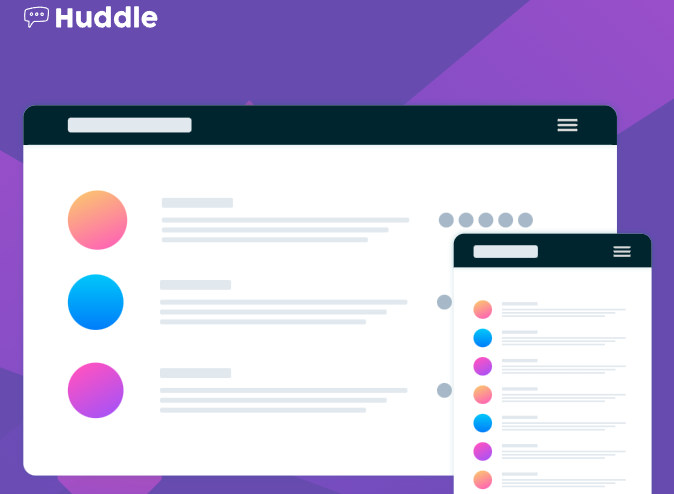

<h1 style="text-align:center">

Esta es mi solución para el desafío: [Huddle landing page challenge on Frontend Mentor](https://www.frontendmentor.io/challenges/huddle-landing-page-with-single-introductory-section-B_2Wvxgi0)

</h1>

## Vista previa



## Vista general

El objetivo fue construir una landing page responsive para Huddle.

La página contiene:

- Logo de Huddle.
- Ilustración principal.
- Botón de registro.
- Redes sociales.
- Estados interactivos.
- Diseño mobile-first.

## Enlaces

- Sitio publicado: [Ver proyecto en vivo](https://yovanidosh.github.io/FmSoLuTiOns/challenges/huddle-landing-page-with-single-introductory-section-master/)

## Lo que aprendí

En este proyecto aprendí a:

- Construir una sección hero responsive.
- Cambiar imágenes de fondo mediante Media Queries.
- Crear layouts de una y dos columnas.
- Utilizar `minmax()` con CSS Grid.
- Crear botones con forma de píldora.
- Aplicar estados `:hover` y `:focus-visible`.
- Crear enlaces sociales circulares.
- Utilizar `clamp()` para tipografía responsive.
- Implementar `prefers-reduced-motion`.
- Mantener una estrategia mobile-first.

## Código destacado

```css
.hero {
  display: grid;
  gap: 4rem;
}

@media (min-width: 64rem) {
  .hero {
    grid-template-columns:
      minmax(0, 1.25fr)
      minmax(20rem, 0.75fr);

    align-items: center;
  }
}
```

Este cambio permite transformar el hero de una columna en móvil a dos columnas en escritorio.

## Accesibilidad

El proyecto incluye:

- HTML semántico.
- Texto alternativo.
- Enlaces sociales accesibles.
- `aria-label`.
- Estados `:focus-visible`.
- Soporte para `prefers-reduced-motion`.

## Responsive Design

El proyecto utiliza una estrategia mobile-first.

En móvil el contenido aparece verticalmente y en escritorio el hero se transforma en un layout de dos columnas.

## Tecnologías utilizadas

- HTML5
- CSS3
- CSS Grid
- Flexbox
- CSS Custom Properties
- Media Queries
- BEM
- Mobile-first

## Author

- Frontend Mentor: [JOHANX](https://www.frontendmentor.io/profile/YovaniDosh)