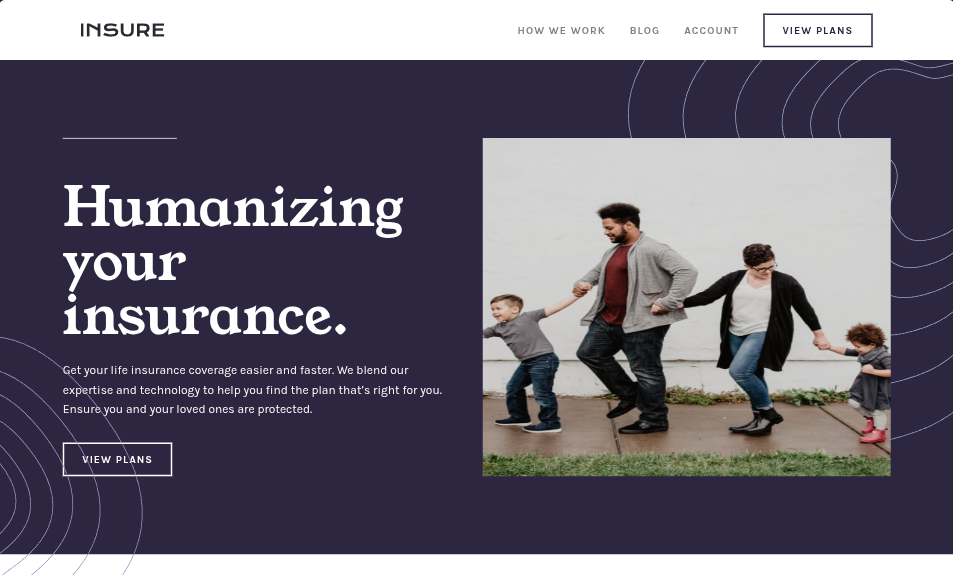

<h1 style="text-align:center">

Esta es mi solución para el desafío:
[Insure Landing Page](https://www.frontendmentor.io/challenges/insure-landing-page-uTU68JV8).

</h1>

## Vista previa



## Vista general

El objetivo fue construir una landing page responsive para una compañía de seguros, manteniendo una navegación accesible y una composición editorial adaptada a diferentes tamaños de pantalla.

La interfaz contiene:

- Navegación principal responsive.
- Menú móvil controlado mediante JavaScript.
- Hero con imagen adaptativa y llamada a la acción.
- Patrones decorativos posicionados con pseudoelementos.
- Sección de ventajas organizada mediante CSS Grid.
- Tarjeta destacada sobre el funcionamiento del servicio.
- Enlaces sociales con nombres accesibles.
- Footer responsive con varios grupos de enlaces.
- Layout Mobile First.

## Enlaces

- Demostración: [Ver proyecto en vivo](https://yovanidosh.github.io/FmSoLuTiOns/challenges/insure-landing-page-master/)

## Lo que aprendí

En este proyecto aprendí a:

- Controlar un menú móvil mediante `aria-expanded`.
- Evitar que una navegación oculta reciba foco utilizando `inert`.
- Actualizar el icono y el nombre accesible del botón según el estado del menú.
- Utilizar `<picture>` para cargar una imagen diferente en móvil y escritorio.
- Superponer una fotografía sobre el hero sin duplicar el contenido.
- Posicionar patrones decorativos fuera de sus contenedores mediante pseudoelementos.
- Crear distribuciones responsive con CSS Grid y Flexbox.
- Organizar estilos y variantes mediante nesting de Sass.
- Cargar fuentes locales con `@font-face`.

## Código destacado

### Navegación móvil accesible

```javascript
function setMenu(open)
{
  menuToggle.setAttribute("aria-expanded", String(open));
  menu.toggleAttribute("inert", !open && !desktopMedia.matches);
  document.body.classList.toggle("menu-open", open);
  menuIcon.src = open
    ? "../../assets/images/insure-icon-close.svg"
    : "../../assets/images/insure-icon-hamburger.svg";
  menuLabel.textContent = open ? "Close menu" : "Open menu";
}
```

`aria-expanded` comunica si el menú está abierto, mientras que `inert` impide que los enlaces ocultos reciban el foco del teclado.

## Accesibilidad

El proyecto incluye:

- HTML semántico.
- Jerarquía ordenada de encabezados.
- Botón nativo para controlar el menú móvil.
- Uso de `aria-expanded` para comunicar el estado de la navegación.
- Uso de `inert` para bloquear el acceso a los enlaces ocultos.
- Estados de foco visibles para teclado.
- Textos alternativos útiles para imágenes informativas.
- Imágenes decorativas con texto alternativo vacío.
- Enlace a redes sociales.
- Compatibilidad con `prefers-reduced-motion`.

## Responsive Design

El proyecto fue construido siguiendo una estrategia Mobile First.

En dispositivos móviles:

- La navegación se muestra dentro de un panel vertical desplegable.
- La imagen principal aparece antes del contenido del hero.
- Las secciones se organizan en una sola columna.
- Los patrones decorativos acompañan el contenido sin formar parte del HTML.
- Los enlaces del footer se distribuyen verticalmente.

En tablet:

- La cuadrícula de ventajas se distribuye en dos columnas.
- Los grupos de enlaces del footer aprovechan mejor el espacio horizontal.

En escritorio:

- La navegación cambia a una distribución horizontal.
- La fotografía se posiciona sobre el hero.
- Los patrones decorativos se superponen a la composición principal.
- Las ventajas se distribuyen en tres columnas.
- La llamada a la acción utiliza una distribución horizontal.
- El footer organiza sus enlaces en cuatro columnas.

## Tecnologías utilizadas

- HTML5 semántico.
- Sass y CSS3.
- CSS Grid y Flexbox.
- JavaScript nativo.
- Fuentes locales Karla y Young Serif.

## Author

- Frontend Mentor: [JOHANX](https://www.frontendmentor.io/profile/YovaniDosh)
