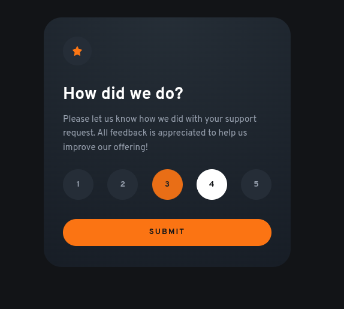

<h1 style="text-align:center">

Esta es mi solución para el reto [Interactive Rating Component.](https://www.frontendmentor.io/challenges/interactive-rating-component-koxpeBUmI)

</h1>

## Vista previa



## Link

Demostración lista para GitHub Pages: [Ver proyecto](https://yovanidosh.github.io/FmSoLuTiOns/challenges/interactive-rating-component-main/)

## Vista general

El objetivo fue construir una tarjeta de valoración responsive que permita seleccionar una puntuación y mostrar una confirmación personalizada.

La interfaz contiene:

- Cinco opciones de valoración.
- Selección única mediante controles de formulario nativos.
- Validación antes de enviar la puntuación.
- Estado de agradecimiento con el resultado elegido.
- Diseño adaptable para dispositivos móviles y escritorio.

## Tecnologías

- HTML5
- CSS3
- JavaScript
- Flexbox
- Media queries
- Propiedades personalizadas de CSS
- Fuente variable local
- SVG

## Lo que aprendí

En este proyecto aprendí a:

- Agrupar opciones relacionadas con `fieldset` y `legend`.
- Personalizar botones de opción sin perder su funcionamiento nativo.
- Obtener el valor seleccionado desde `form.elements`.
- Cambiar entre dos estados de una interfaz con el atributo `hidden`.
- Mostrar datos dinámicos mediante el elemento `output`.
- Crear estados `hover`, `checked` y `focus-visible` accesibles.
- Respetar las preferencias de movimiento reducido.
- Cargar una fuente variable local mediante `@font-face`.

## Código destacado

### Envío de la valoración

```javascript
ratingForm.addEventListener('submit', (event) => {
  event.preventDefault();

  const selectedRating = ratingForm.elements.rating.value;

  if (!selectedRating) {
    return;
  }

  ratingOutput.value = selectedRating;
  ratingCard.hidden = true;
  thankYouCard.hidden = false;
});
```

El formulario aprovecha la selección única de los botones de opción. Al enviarlo, JavaScript copia el valor elegido y muestra el mensaje final.

## Accesibilidad

El proyecto incluye:

- HTML semántico con formulario y secciones identificadas.
- Opciones agrupadas mediante `fieldset` y `legend`.
- Controles operables con teclado.
- Validación nativa mediante `required`.
- Estados de foco visibles.
- Imágenes decorativas con texto alternativo vacío.
- Resultado dinámico representado con `output`.

## Responsive Design

En dispositivos móviles:

- La tarjeta utiliza el ancho disponible con espacios compactos.
- Las opciones se distribuyen uniformemente.
- El contenido mantiene una lectura clara desde 320 px.

En escritorio:

- La tarjeta permanece centrada y conserva un ancho máximo.
- Aumentan el espacio interior, los controles y la tipografía.
- Ambos estados mantienen dimensiones visuales consistentes.

## Autor

- Frontend Mentor: [JOHANX](https://www.frontendmentor.io/profile/YovaniDosh)
