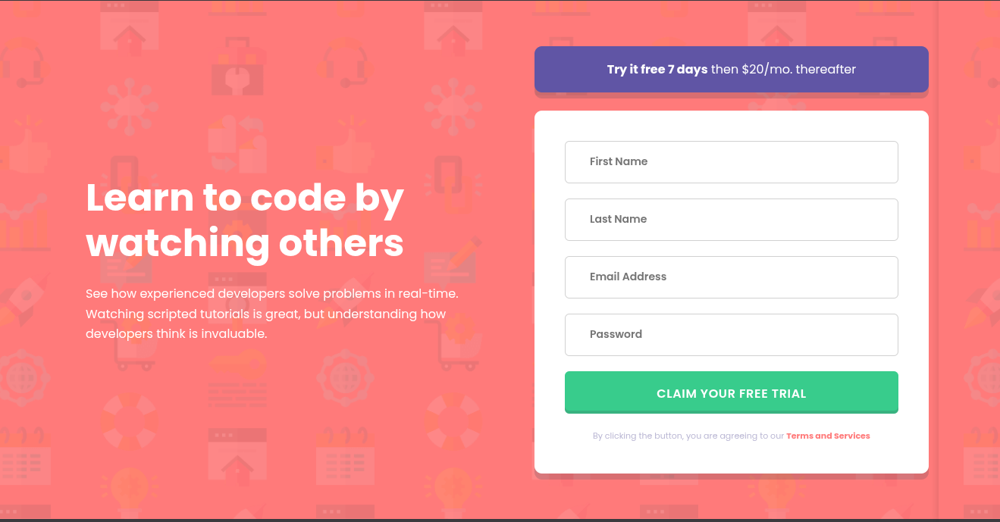

<h1 style="text-align:center">

Esta es mi solución para el desafío:
[Intro Component With Sign Up Form](https://www.frontendmentor.io/challenges/intro-component-with-signup-form-5ce5d66f634b3500d9b2a9c5).

</h1>

## Vista previa



## Vista general

El objetivo fue construir una sección de introducción responsive con un formulario de registro y validación accesible.

La interfaz contiene:

- Presentación del servicio de aprendizaje.
- Oferta de prueba gratuita.
- Formulario con cuatro campos.
- Mensajes de error específicos para campos vacíos.
- Validación especial para correos incorrectos.
- Diseño Mobile First.
- Layout de dos columnas para escritorio.

## Enlaces

- Sitio publicado: [Ver proyecto en vivo](https://yovanidosh.github.io/FmSoLuTiOns/challenges/intro-component-with-signup-form-master/)

## Lo que aprendí

En este proyecto aprendí a:

- Validar varios campos mediante una estructura de datos reutilizable.
- Consultar `validity.valueMissing` y `validity.typeMismatch`.
- Generar mensajes diferentes según el error detectado.
- Sincronizar los errores visuales con `aria-invalid` y `aria-live`.
- Devolver el foco al primer campo incorrecto.
- Usar `toggleAttribute()` para comunicar estados booleanos.
- Construir un layout Mobile First con CSS Grid.
- Crear estados `hover`, `active` y `focus-visible`.
- Cargar Poppins Variable localmente mediante `@font-face`.
- Mantener las imágenes compartidas dentro de `assets/images/`.
- Respetar `prefers-reduced-motion`.

## Código destacado

### Validación reutilizable

```javascript
function updateField(field)
{
  const message = getErrorMessage(field);
  const hasError = message !== "";

  field.input.toggleAttribute("aria-invalid", hasError);
  return !hasError;
}
```

Cada campo utiliza la misma función para actualizar su estado visual y accesible. Esto evita repetir la lógica para nombre, apellido, correo y contraseña.

## Accesibilidad

El proyecto incluye:

- HTML semántico.
- Etiquetas asociadas a todos los campos.
- Mensajes dinámicos mediante `aria-live`.
- Errores comunicados con `aria-invalid`.
- Foco automático en el primer campo incorrecto.
- Nombre accesible para cada control.
- Estados de foco visibles para teclado.
- Iconos decorativos ocultos con `aria-hidden`.
- Compatibilidad con `prefers-reduced-motion`.

## Responsive Design

El proyecto fue construido siguiendo una estrategia mobile-first.

En dispositivos móviles:

- El contenido y el formulario se muestran en una columna.
- Los textos permanecen centrados.
- Los controles ocupan todo el ancho disponible.

En escritorio:

- La interfaz cambia a una cuadrícula de dos columnas.
- La introducción se alinea a la izquierda.
- La oferta y el formulario comparten la segunda columna.
- El fondo utiliza la versión optimizada para escritorio.

## Author

- Frontend Mentor: [JOHANX](https://www.frontendmentor.io/profile/YovaniDosh)
