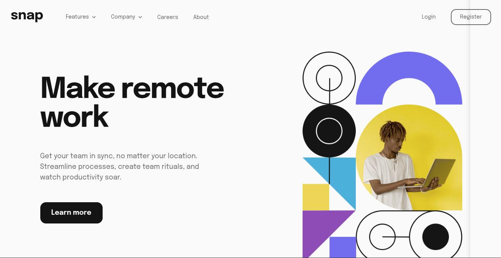

<h1 style="text-align:center">

Esta es mi solución para el reto [Intro Section With Dropdown Navigation.](https://www.frontendmentor.io/challenges/intro-section-with-dropdown-navigation-ryaPetHE5)

</h1>

## Vista previa



## Link

[Ver proyecto](https://yovanidosh.github.io/FmSoLuTiOns/challenges/intro-section-with-dropdown-navigation-main/)

## Vista general

El objetivo fue construir una sección introductoria responsive con navegación desplegable, menú lateral móvil e imagen hero adaptativa.

La interfaz contiene:

- Navegación principal con dos submenús independientes.
- Menú lateral para dispositivos móviles.
- Acciones de inicio de sesión y registro.
- Hero con imágenes diferentes para móvil y escritorio.
- Llamada a la acción.
- Lista de clientes colaboradores.

## Tecnologías

- HTML5
- CSS3
- JavaScript
- CSS Grid
- Flexbox
- Fuente variable local
- Media queries

## Lo que aprendí

En este proyecto aprendí a:

- Crear menús desplegables mediante botones nativos.
- Comunicar su estado con `aria-expanded` y `aria-controls`.
- Relacionar cada botón con su propio submenú.
- Cambiar iconos según el estado abierto o cerrado.
- Mantener el foco dentro del panel móvil.
- Cerrar los desplegables al pulsar fuera de ellos o usar `Escape`.
- Cambiar entre imágenes responsive mediante `picture`.
- Cargar la fuente variable Epilogue desde un archivo local.

## Código destacado

### Estado reutilizable de los desplegables

```javascript
function setDropdownState(button, isOpen) {
  const menuId = button.getAttribute('aria-controls');
  const menu = document.getElementById(menuId);
  const arrow = button.querySelector('.dropdown__arrow');

  button.setAttribute('aria-expanded', String(isOpen));
  menu.hidden = !isOpen;
  arrow.src = isOpen
    ? '../../assets/images/icon-arrow-up.svg'
    : '../../assets/images/icon-arrow-down.svg';
}
```

Una sola función sincroniza el estado accesible del botón, la visibilidad del submenú y la dirección de la flecha. Esto evita repetir la misma lógica para “Features” y “Company”.

## Accesibilidad

El proyecto incluye:

- Regiones semánticas con `header`, `nav`, `main`, `section` y `footer`.
- Botones nativos para controlar el menú y los desplegables.
- Estados comunicados mediante `aria-expanded`.
- Relaciones creadas mediante `aria-controls`.
- Navegación completa con teclado.
- Cierre mediante la tecla `Escape`.
- Control y devolución del foco en el menú móvil.
- Estados `focus-visible` perceptibles.
- Textos alternativos para el hero y los clientes.
- Compatibilidad con `prefers-reduced-motion`.

## Responsive Design

En dispositivos móviles:

- La imagen hero aparece antes del contenido textual.
- La navegación se abre como un panel lateral.
- Los desplegables amplían el contenido dentro del panel.
- El texto y las marcas permanecen centrados.

En escritorio:

- La navegación permanece visible en el encabezado.
- Los submenús aparecen como paneles flotantes.
- El contenido textual ocupa la primera columna.
- La imagen hero ocupa la segunda columna.
- Las marcas se alinean en la parte inferior del contenido.

## Autor

- Frontend Mentor: [JOHANX](https://www.frontendmentor.io/profile/YovaniDosh)
