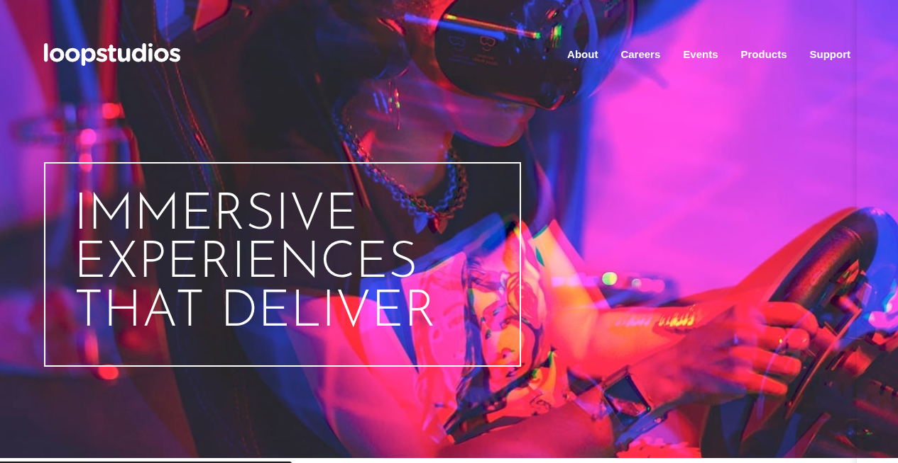

<h1 style="text-align:center">

Esta es mi solución para el reto [Loopstudios Landing Page.](https://www.frontendmentor.io/challenges/loopstudios-landing-page-N88J5Onjw)

</h1>

## Vista previa



## Link

[Ver proyecto](https://yovanidosh.github.io/FmSoLuTiOns/challenges/loopstudios-landing-page-main/)

## Vista general

El objetivo fue construir una landing page responsive para presentar experiencias de realidad virtual y una galería de creaciones.

La interfaz contiene:

- Hero con mensaje principal y navegación.
- Menú móvil de pantalla completa.
- Presentación de la empresa.
- Galería responsive de ocho creaciones.
- Enlaces sociales y navegación secundaria.

## Tecnologías

- HTML5 semántico
- Sass
- CSS3 compilado
- JavaScript
- CSS Grid
- Flexbox
- Imágenes responsive

## Lo que aprendí

- Componer una galería diferente para móvil y escritorio.
- Utilizar `<picture>` para servir imágenes adaptadas al viewport.
- Superponer contenido mediante gradientes y posicionamiento.
- Organizar colores, fuentes y breakpoints con variables Sass.
- Crear estados interactivos equivalentes para puntero y teclado.

## Código destacado

```scss
.creations__grid
{
  display: grid;
  grid-template-columns: repeat(4, minmax(0, 1fr));
  gap: 1.9rem;
}
```

En escritorio, la galería utiliza cuatro columnas flexibles. Cada tarjeta conserva su propio contenido y cambia automáticamente de fila según el espacio disponible.

## Accesibilidad

- Navegaciones con nombres accesibles.
- Botón nativo relacionado con el menú mediante `aria-controls`.
- Estado móvil comunicado mediante `aria-expanded`.
- Enlaces ocultos retirados del foco con `inert`.
- Cierre del menú mediante enlaces y tecla `Escape`.
- Recuperación del foco al cerrar con teclado.
- Estados `:hover` y `:focus-visible`.
- Respeto de `prefers-reduced-motion`.

## Responsive Design

En móvil, el menú ocupa la pantalla completa, el contenido se apila y las creaciones utilizan imágenes horizontales. En escritorio, la navegación permanece visible, la presentación se superpone a su imagen y la galería muestra cuatro columnas verticales.

## Autor

- Frontend Mentor: [JOHANX](https://www.frontendmentor.io/profile/YovaniDosh)
