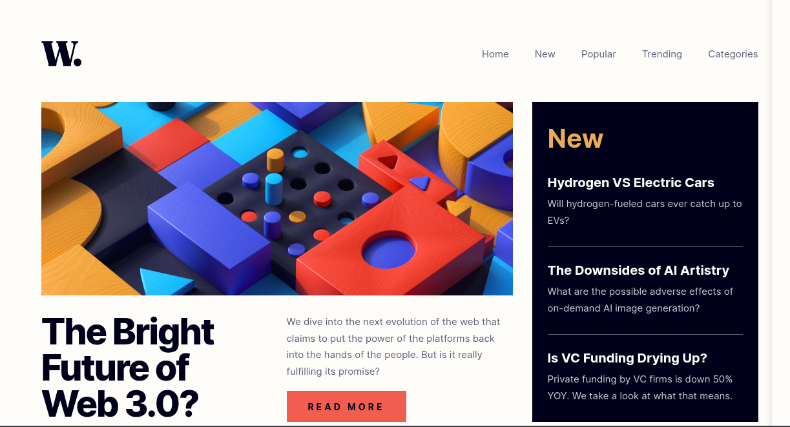

<h1 style="text-align:center">

Esta es mi solución para el reto [News Homepage.](https://www.frontendmentor.io/challenges/news-homepage-H6SWTa1MFl)

</h1>

## Vista previa



## Link

[Ver proyecto](https://yovanidosh.github.io/FmSoLuTiOns/challenges/news-homepage-main/)

## Vista general

El objetivo fue construir una portada de noticias responsive con una noticia principal, novedades, artículos populares y navegación adaptable.

La interfaz contiene:

- Encabezado con navegación principal.
- Menú lateral para dispositivos móviles.
- Imagen principal adaptativa mediante `picture`.
- Sección de noticias recientes.
- Lista numerada de artículos populares.
- Layout Mobile First reorganizado con CSS Grid.

## Tecnologías

- HTML5
- Sass
- CSS3 compilado
- JavaScript
- CSS Grid
- Flexbox
- Fuente variable local
- npm

## Lo que aprendí

En este proyecto aprendí a:

- Construir una portada editorial con elementos semánticos.
- Cambiar imágenes según el viewport mediante `picture` y `source`.
- Reorganizar contenido con CSS Grid sin modificar su orden semántico.
- Crear un menú lateral accesible para dispositivos móviles.
- Mantener el foco dentro de una navegación abierta.
- Cerrar el menú con un botón, el fondo, un enlace o la tecla `Escape`.
- Utilizar variables y nesting de Sass sin crear abstracciones innecesarias.
- Compilar Sass a CSS compatible con GitHub Pages.

## Código destacado

### Cambio accesible del estado del menú

```javascript
function openMenu() {
  document.body.classList.add('menu-open');
  menuButton.setAttribute('aria-expanded', 'true');
  closeButton.focus();
}

function closeMenu({ restoreFocus = true } = {}) {
  document.body.classList.remove('menu-open');
  menuButton.setAttribute('aria-expanded', 'false');

  if (restoreFocus) {
    menuButton.focus();
  }
}
```

El estado visual se controla con una clase en `body`, mientras `aria-expanded` comunica el mismo cambio a las tecnologías de asistencia. Al cerrar, el foco regresa al botón que abrió el menú.

## Accesibilidad

El proyecto incluye:

- Regiones semánticas con `header`, `nav`, `main`, `article`, `aside` y `footer`.
- Jerarquía clara de encabezados.
- Botones nativos para abrir y cerrar el menú.
- Estado del menú comunicado mediante `aria-expanded`.
- Nombres accesibles para controles con iconos.
- Textos alternativos descriptivos en imágenes informativas.
- Navegación por teclado y cierre mediante `Escape`.
- Estados `focus-visible` perceptibles.
- Compatibilidad con `prefers-reduced-motion`.

## Responsive Design

En dispositivos móviles:

- El contenido se presenta en una sola columna.
- La navegación se abre como un panel lateral.
- Una capa oscura separa el menú del contenido.
- Se utiliza la imagen principal optimizada para móvil.

En escritorio:

- La navegación permanece visible en el encabezado.
- La noticia principal ocupa dos columnas.
- La sección de novedades ocupa la tercera columna.
- Los artículos populares forman una fila de tres elementos.

## Compilación

El archivo fuente se encuentra en `scss/style.scss`. Para actualizar el CSS utilizado por el navegador:

```bash
npx sass challenges/news-homepage-main/scss/style.scss challenges/news-homepage-main/css/style.css --style=expanded
```

## Autor

- Frontend Mentor: [JOHANX](https://www.frontendmentor.io/profile/YovaniDosh)
