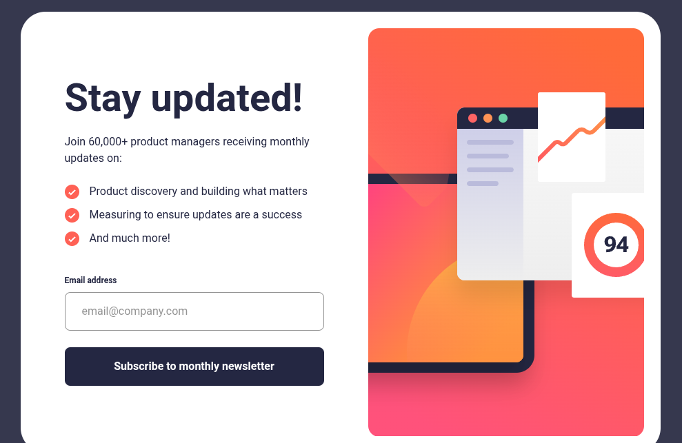

<h1 style="text-align:center">

Esta es mi solución para el reto [Newsletter Sign-up Form with Success Message.](https://www.frontendmentor.io/challenges/newsletter-signup-form-with-success-message-3FC1AZbNrv)

</h1>

## Vista previa



## Link

Sitio publicado: [Ver proyecto en vivo](https://yovanidosh.github.io/FmSoLuTiOns/challenges/newsletter-sign-up-with-success-message-main/)

## Vista general

El objetivo fue construir un formulario responsive para suscribirse a un boletín y mostrar una confirmación después de enviar un correo válido.

La interfaz contiene:

- Lista de beneficios del boletín.
- Campo de correo electrónico.
- Validación para direcciones vacías o no válidas.
- Mensaje de error accesible.
- Pantalla de confirmación con el correo enviado.
- Botón para cerrar la confirmación y volver al formulario.
- Diseño adaptable para dispositivos móviles, tabletas y escritorio.

## Tecnologías

- HTML5
- CSS3
- JavaScript
- Flexbox
- CSS Grid
- Media queries
- Propiedades personalizadas de CSS
- SVG

## Lo que aprendí

En este proyecto aprendí a:

- Construir un formulario accesible con un `<label>` asociado al campo.
- Utilizar la validación nativa del tipo `email` mediante `validity.valid`.
- Comunicar errores con `aria-live` y `aria-invalid`.
- Alternar entre el formulario y el mensaje de confirmación con el atributo `hidden`.
- Insertar de forma segura el correo enviado mediante `textContent`.
- Ofrecer imágenes adaptadas a distintos tamaños mediante `<picture>`.
- Crear un layout Mobile First que cambia de Flexbox a Grid.
- Respetar la navegación por teclado con estados `:focus-visible`.

## Código destacado

### Cambio al estado de confirmación

```javascript
function showSuccess() {
  submittedEmail.textContent = emailInput.value;
  signUpSection.hidden = true;
  successSection.hidden = false;
  dismissButton.focus();
}
```

El correo se añade con `textContent`, se oculta el formulario y el foco pasa al botón principal de la confirmación para mantener un recorrido claro con teclado.

### Validación del correo electrónico

```javascript
if (!emailInput.validity.valid) {
  showError();
  return;
}
```

La API de validación del navegador comprueba tanto el campo obligatorio como el formato del correo sin depender de librerías externas.

## Accesibilidad

El proyecto incluye:

- HTML semántico y jerarquía correcta de encabezados.
- Etiqueta visible asociada al campo de correo.
- Mensajes dinámicos mediante `aria-live`.
- Uso de `aria-invalid` para comunicar errores.
- Texto alternativo para la ilustración informativa.
- Foco visible en controles interactivos.
- Gestión del foco al cambiar entre las dos vistas.
- Soporte para `prefers-reduced-motion`.

## Responsive Design

En dispositivos móviles:

- La ilustración ocupa la parte superior de la pantalla.
- El contenido y el formulario se organizan en una sola columna.
- La confirmación aprovecha toda la altura y mantiene el botón al final.

En tabletas y escritorio:

- El contenido se presenta dentro de una tarjeta centrada.
- La ilustración utiliza una variante adecuada al ancho disponible.
- En escritorio, el texto y la imagen forman dos columnas mediante CSS Grid.
- El mensaje de confirmación se muestra en una tarjeta compacta.

## Autor

- Frontend Mentor: [JOHANX](https://www.frontendmentor.io/profile/YovaniDosh)
