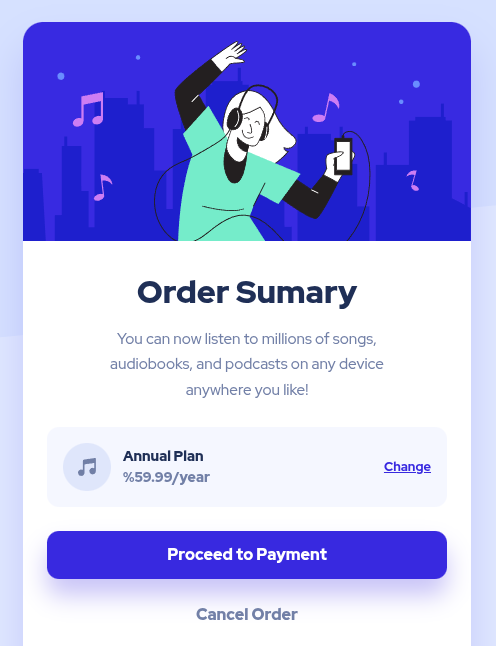

# Frontend Mentor - Order Summary Component

Solución al desafío: [Order Summary Component.](https://www.frontendmentor.io/challenges/order-summary-component-QlPmajDUj)

## Vista previa




## Vista general

El objetivo fue construir una tarjeta de resumen de pedido con:

- Ilustración principal.
- Descripción del servicio.
- Resumen del plan.
- Enlace para cambiar el plan.
- Botón de pago.
- Botón para cancelar.
- Fondo decorativo responsive.

## Enlaces

- Sitio publicado: [Ver proyecto en vivo](https://yovanidosh.github.io/FmSoLuTiOns/challenges/order-summary-component-main)

## Tecnologías utilizadas

- HTML5 semántico
- CSS3
- CSS Grid
- Flexbox
- Variables Css
- Propiedades personalizadas de CSS
- Diseño mobile-first
- Responsive design
- Fuentes locales
- Metodologia BEM

## Lo que aprendí

- Organizar clases con la metodología BEM.
- Separar un componente en bloque y elementos.
- Crear una sombra sólida desplazada.
- Aplicar estados interactivos con `:hover`.
- Usar una fuente variable local.
- Construir un componente mobile-first.
- Crear un fondo responsive usando imágenes diferentes para móvil y escritorio.
- Aplicar imágenes decorativas con `background-image`.
- Crear variantes reutilizables de botones.
- Aplicar sombras suaves a tarjetas y botones.
- Crear estados `hover`, `focus-visible` y `active`.
- Extraer patrones visuales hacia una biblioteca de componentes.
- Respetar `prefers-reduced-motion`.

```
@media (prefers-reduced-motion: reduce) {
  *,
  *::before,
  *::after {
    transition-duration: 0.01ms;
  }
}

```

## Componentes reutilizables

Este reto permitió crear:

- `button`
- `button--primary`
- `button--secondary`
- tarjeta centrada
- enlace interactivo

La versión genérica del botón se guardó en:

```text
components/buttons/button.css
```

## Autor

- Frontend Mentor: [JOHANX](https://www.frontendmentor.io/profile/YovaniDosh)

