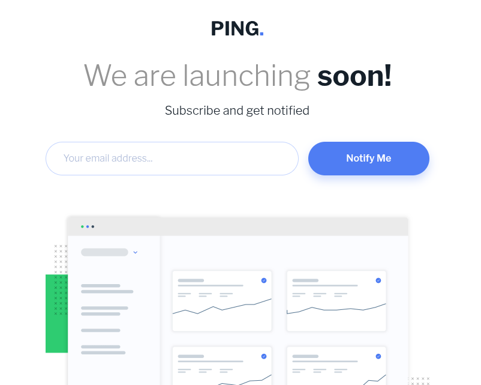

<h1 style = "text-align:center">

Esta es mi solución para el reto [Ping Coming Soon Page.](https://www.frontendmentor.io/challenges/ping-single-column-coming-soon-page-5cadd051fec04111f7)

</h1>

## Vista previa



## Link

Sitio publicado: [Ver proyecto en vivo](https://yovanidosh.github.io/FmSoLuTiOns/challenges/ping-coming-soon-page-master/)

## Vista general

El objetivo fue construir una página de lanzamiento responsive con un formulario de suscripción.

La interfaz contiene:

- Logotipo de Ping.
- Mensaje de próximo lanzamiento.
- Formulario de suscripción por correo electrónico.
- Validación para direcciones de correo no válidas.
- Ilustración del panel de estadísticas.
- Enlaces a redes sociales.
- Diseño adaptable para dispositivos móviles y escritorio.

## Tecnologías

- HTML5
- CSS3
- JavaScript
- Flexbox
- CSS Grid
- Media queries
- Propiedades personalizadas de CSS
- SVG

## Lo que aprendí

En este proyecto aprendí a:

- Construir un formulario accesible con `<label>` asociado a su campo.
- Utilizar el tipo de entrada `email` para validar el formato del correo.
- Consultar la API de validación nativa mediante `validity.valid`.
- Mostrar mensajes de error con `aria-live`.
- Indicar campos incorrectos mediante `aria-invalid`.
- Evitar el mensaje predeterminado del navegador utilizando `novalidate`.
- Cambiar la apariencia del formulario mediante una clase de estado.
- Crear un layout responsive combinando CSS Grid y Flexbox.
- Adaptar tamaños tipográficos con `clamp()`.
- Crear iconos sociales mediante SVG en línea.
- Diseñar estados `hover`, `focus` y `active` accesibles.
- Utilizar variables CSS para mantener consistentes los colores del diseño.

## Código destacado

### Validación del correo electrónico

```javascript
form.addEventListener('submit', (event) => {
  event.preventDefault();

  if (!email.validity.valid) {
    showError();
    email.focus();
    return;
  }

  clearError();
  form.reset();
});
```

La validación nativa comprueba si el campo está vacío o si el texto ingresado no tiene un formato de correo válido.

### Estado de error accesible

```javascript
function showError() {
  form.classList.add('has-error');
  email.setAttribute('aria-invalid', 'true');
  errorMessage.textContent = 'Please provide a valid email address';
}
```

La clase `has-error` modifica el borde del campo y `aria-invalid` comunica el error a las tecnologías de asistencia.

## Accesibilidad

El proyecto incluye:

- HTML semántico.
- Etiqueta accesible para el campo de correo.
- Mensajes dinámicos mediante `aria-live`.
- Uso de `aria-invalid` para comunicar errores.
- Texto alternativo en las imágenes.
- Navegación identificada con `aria-label`.
- Nombres accesibles para los enlaces sociales.
- Estados de foco visibles para teclado.
- Jerarquía correcta de encabezados.

## Responsive Design

En dispositivos móviles:

- El formulario se organiza en una sola columna.
- El campo y el botón ocupan todo el ancho disponible.
- Los tamaños de texto y los espacios se adaptan a pantallas pequeñas.

En escritorio:

- El campo de correo y el botón se muestran en la misma fila.
- El contenido permanece centrado con un ancho máximo.
- La ilustración conserva su proporción original.

## Autor

- Frontend Mentor: [JOHANX](https://www.frontendmentor.io/profile/YovaniDosh)
