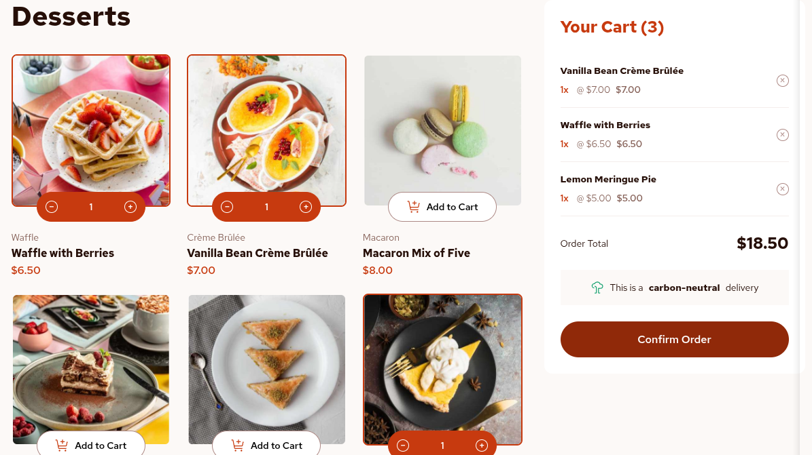

<h1 style = "text-align:center">

Esta es mi solución para el reto [Product List with Cart.](https://www.frontendmentor.io/challenges/product-list-with-cart-5MmqLVAp_d)

</h1>

## Vista previa

## Link

- [Ver proyecto ](https://yovanidosh.github.io/FmSoLuTiOns/challenges/product-list-with-cart-main/)

## Tecnologías utilizadas

- HTML5 semántico
- Sass
- JavaScript
- CSS Grid y Flexbox
- Fuente variable local Red Hat Text
- Diseño mobile-first
- Metodología BEM
- Responsive design

## Lo que aprendí

- Representar el estado del carrito mediante un `Map`.
- Renderizar productos y controles desde JavaScript.
- Mantener sincronizadas las cantidades, los subtotales y el total general.
- Utilizar `<picture>` para cargar imágenes según el dispositivo.
- Crear una confirmación accesible mediante `<dialog>`.
- Gestionar acciones con delegación de eventos y atributos `data-action`.
- Formatear importes con `Intl.NumberFormat`.
- Organizar los estilos mediante Sass y un enfoque mobile-first.

## Autor

- Frontend Mentor: [JOHANX](https://www.frontendmentor.io/profile/YovaniDosh)
