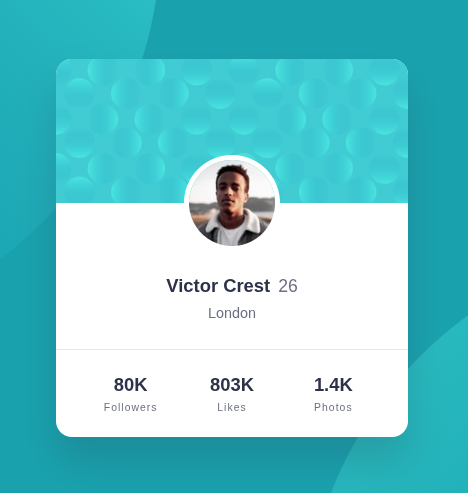

<h1 style = "text-align:center">

Esta es mi solución para el desafío: [Profile card component challenge on Frontend Mentor](https://www.frontendmentor.io/challenges/profile-card-component-cfArpWshJ)

</h1>

## Vista previa



## Vista general

El objetivo fue construir una tarjeta de perfil responsive respetando el diseño proporcionado por Frontend Mentor.

La tarjeta contiene:

- Imagen decorativa superior.
- Avatar superpuesto.
- Nombre y edad del usuario.
- Ubicación.
- Número de seguidores.
- Número de likes.
- Número de fotografías.
- Fondo compuesto por elementos decorativos.
- Diseño completamente responsive.

## Enlaces

- Sitio publicado: [Ver proyecto en vivo](https://yovanidosh.github.io/FmSoLuTiOns/challenges/profile-card-component-main/)

## Lo que aprendí

En este proyecto aprendí a:

- Crear fondos utilizando múltiples imágenes con `background`.
- Combinar varias capas de `background-image`.
- Posicionar imágenes decorativas independientemente del contenido.
- Superponer un avatar entre dos secciones.
- Utilizar `position: relative` como referencia para elementos posicionados.
- Centrar horizontalmente un elemento con `left: 50%`.
- Combinar `left: 50%` con `transform: translate(-50%, -50%)`.
- Crear imágenes perfectamente circulares con `border-radius: 50%`.
- Utilizar `aspect-ratio` para mantener proporciones.
- Utilizar `object-fit: cover`.
- Centrar componentes con CSS Grid y `place-items: center`.
- Crear tres columnas iguales con CSS Grid.
- Construir el proyecto siguiendo una estrategia mobile-first.

## Código destacado

### Avatar superpuesto

```css
.profile-card__content 
{
  position: relative;
}

.profile-card__avatar 
{
  position: absolute;
  top: 0;
  left: 50%;
  width: 6rem;
  aspect-ratio: 1;
  border: 0.35rem solid var(--color-white);
  border-radius: 50%;
  object-fit: cover;
  transform: translate(-50%, -50%);
}
```

Esta técnica permite colocar el avatar exactamente entre la imagen superior y el contenido de la tarjeta.

### Múltiples fondos

```css
body 
{
  background:

    url("../../../assets/images/bg-pattern-top.svg")
      top -25rem left -30rem / 45rem
      no-repeat,

    url("../../../assets/images/bg-pattern-bottom.svg")
      bottom -25rem right -32rem / 45rem
      no-repeat,

    var(--color-cyan);
}
```

Aprendí que CSS permite combinar varias imágenes y un color dentro de una única propiedad `background`.

Esto evita crear elementos HTML exclusivamente para decoración.

## Accesibilidad

El proyecto incluye:

- HTML semántico.
- Uso de `<main>` y `<article>`.
- Texto alternativo descriptivo para el avatar.
- Imágenes decorativas con `alt=""`.
- Jerarquía de encabezados.
- CSS Grid.
- Mobile-first.
- Media Queries.

## Responsive Design

El proyecto fue construido siguiendo una estrategia mobile-first.

La estructura principal de la tarjeta permanece estable entre dispositivos porque el componente tiene un ancho máximo controlado.

En pantallas mayores se modifica principalmente la posición de los elementos decorativos del fondo.

Esto permite mantener el componente consistente sin introducir breakpoints innecesarios.

## Tecnologías utilizadas

- HTML5
- CSS3
- CSS Grid
- CSS Custom Properties
- BEM
- Media Queries
- Mobile-first

## Author

- Frontend Mentor: [JOHANX](https://www.frontendmentor.io/profile/YovaniDosh)