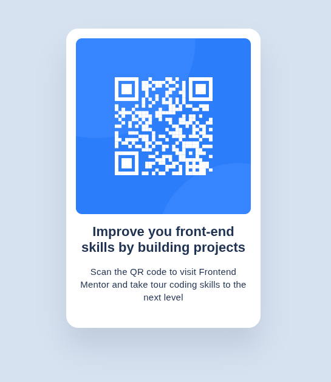

<h1 style = "text-align:center">

Esta es mi solución para el reto [QR Code Component de Frontend Mentor](https://www.frontendmentor.io/challenges/qr-code-component-iux_sIO_H).

</h1>
## Vista previa

## Enlaces

- Sitio publicado: [Ver proyecto en vivo](https://yovanidosh.github.io/FmSoLuTiOns/challenges/qr-code-component-main/)

## Tecnologías utilizadas

- HTML5 semántico
- CSS
- Flexbox
- Propiedades personalizadas de CSS
- Diseño mobile-first
- Responsive design

## Lo que aprendí

Durante este reto practiqué:

- La creación de una tarjeta utilizando HTML semántico.
- Centrar una tarjeta horizontal y verticalmente con Flexbox.
- Usar `min-height: 100vh`.
- Limitar el ancho de un componente con `max-width`.
- El funcionamiento del modelo de caja de CSS.
- El uso de propiedades personalizadas para organizar colores.
- Crear bordes redondeados.
- Trabajar con padding y margin.
- Adaptar un componente a dispositivos móviles.
- La importancia del texto alternativo en las imágenes.

## Autor

- Frontend Mentor: [JOHANX](https://www.frontendmentor.io/profile/YovaniDosh)
