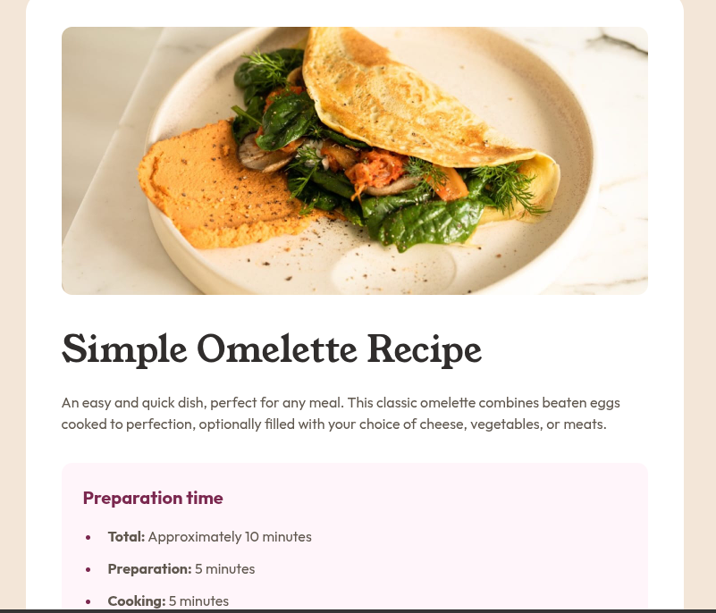

<h1 style = "text-align:center">

Esta es mi solución para el reto [Recipe/Preview/Card.](https://www.frontendmentor.io/challenges/recipe-page-KiTsR8QQKm)

</h1>

## Vista previa



## Link 

Sitio publicado : [Ver proyecto en vivo:](https://yovanidosh.github.io/FmSoLuTiOns/challenges/recipe-page-main/)

El objetivo fue construir una página de receta responsive con:

- Imagen principal.
- Introducción.
- Tiempo de preparación.
- Ingredientes.
- Instrucciones numeradas.
- Información nutricional.

## Tecnologías

- HTML5
- CSS3
- Flexbox / Grid
- Listas semánticas
- Tablas HTML
- Media queries
- Fuentes locales
- Metodologia BEM

## Lo que aprendí

En este proyecto aprendí a:

- Utilizar HTML semántico para contenido editorial.
- Dividir contenido largo mediante `<section>`.
- Utilizar `<aside>` para información complementaria.
- Crear listas ordenadas y desordenadas.
- Personalizar los marcadores con `::marker`.
- Usar `<strong>` para destacar información importante.
- Crear una tabla semántica con `<table>`, `<tr>`, `<th>` y `<td>`.
- Utilizar `scope="row"` para mejorar la accesibilidad de tablas.
- Crear divisores utilizando `border-bottom`.
- Diseñar primero una versión móvil sin tarjeta exterior.
- Transformar la página en una tarjeta centrada para escritorio.
- Extraer componentes reutilizables de contenido, listas y tablas.

## Código destacado

### Marcadores personalizados

```css
.recipe-list li::marker {
  color: var(--color-brown-800);
  font-weight: 700;
}
```

### Tabla semántica

```html
<tr>
  <th scope="row">Calories</th>
  <td>277kcal</td>
</tr>
```

## Accesibilidad

- Imagen con texto alternativo.
- Jerarquía correcta de encabezados.
- Listas semánticas.
- Tabla con encabezados.
- Contenido organizado mediante secciones.

## Autor

- Frontend Mentor: [JOHANX](https://www.frontendmentor.io/profile/YovaniDosh)