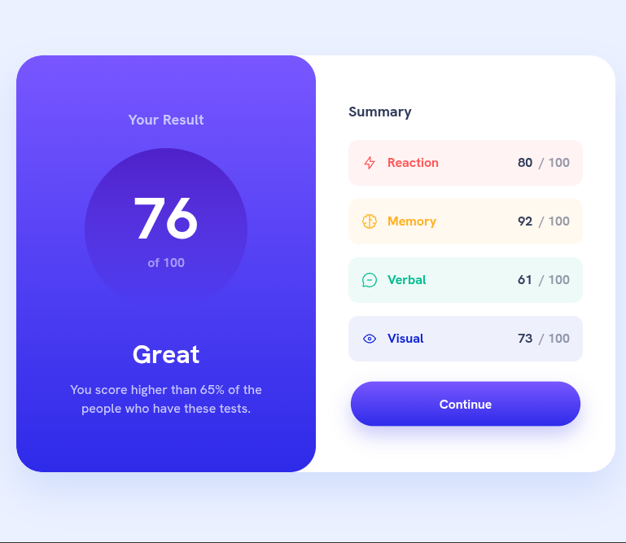

# Frontend Mentor - Results-Summary-Component

Solución al desafío: [Order Summary Component.](https://www.frontendmentor.io/challenges/results-summary-component-CE_K6s0maV)

## Vista previa




## Vista general

El objetivo fue construir una tarjeta responsive que presentara:

- Puntuación general.
- Evaluación del resultado.
- Resumen por categorías.
- Iconos y colores diferenciados.
- Botón de continuación.
- Datos renderizados con JavaScript.


## Enlaces

- Sitio publicado: [Ver proyecto en vivo](https://yovanidosh.github.io/FmSoLuTiOns/challenges/results-summary-component-main)

## Tecnologías utilizadas

- HTML5 semántico
- CSS3
- CSS Grid
- Flexbox
- Variables Css
- Propiedades personalizadas de CSS
- Diseño mobile-first
- Responsive design
- Fuentes locales
- Metodologia BEM
- JavaScript ES Modules
- Gradientes
- Animaciones
- Media queries

## En este proyecto aprendí a:

- Separar los datos de la interfaz.
- Importar información entre módulos JavaScript.
- Insertar elementos dinámicos con `innerHTML`.
- Crear variantes visuales según una categoría.
- Usar gradientes lineales.
- Crear un círculo perfecto con `aspect-ratio`.

```css
.score-circle {
  aspect-ratio: 1;
  border-radius: 50%;
}
```

- Añadir animaciones mediante `@keyframes`.
- Respetar `prefers-reduced-motion`.
- Crear componentes reutilizables para puntuaciones.
- Convertir un layout móvil en dos columnas.
- Mantener una estructura escalable.
- Generar componentes con `map()`.

```js
summaryList.innerHTML = results
  .map(createSummaryItem)
  .join("");

```

## Autor

- Frontend Mentor: [JOHANX](https://www.frontendmentor.io/profile/YovaniDosh)

