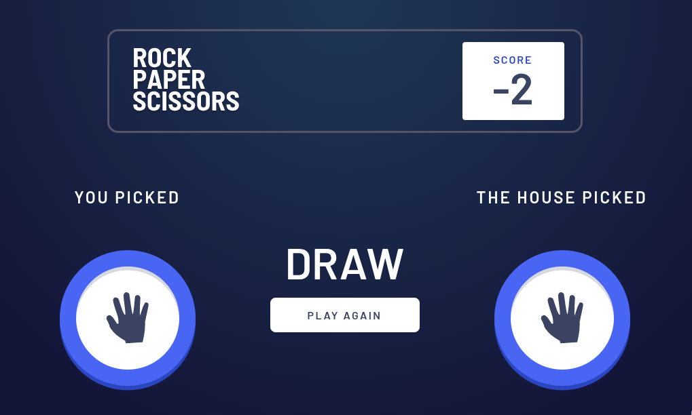

<h1 style="text-align:center">

Esta es mi solución para el desafío:
[Rock, Paper, Scissors](https://www.frontendmentor.io/challenges/rock-paper-scissors-game-pTgwgvgH).

</h1>

## Vista previa



## Vista general

El objetivo fue construir un juego responsive de piedra, papel o tijeras contra la computadora utilizando JavaScript nativo.

La interfaz contiene:

- Marcadores separados para el jugador y la computadora.
- Tres botones para elegir piedra, papel o tijeras.
- Elección aleatoria de la computadora.
- Vista de resultado con ambas jugadas.
- Partida al mejor objetivo: gana quien alcance primero 3 victorias.
- Mensaje final `You win` o `You lose` y botón para comenzar una partida nueva.
- Diálogo modal con las reglas.
- Layout Mobile First adaptado a escritorio.

## Enlaces

- Demostración: [Ver proyecto en vivo](https://yovanidosh.github.io/FmSoLuTiOns/challenges/rock-paper-scissors-master/)

## Lo que aprendí

En este proyecto aprendí a:

- Representar las reglas de un juego mediante objetos de JavaScript.
- Seleccionar un elemento aleatorio de un array.
- Separar la lógica en funciones pequeñas con una responsabilidad concreta.
- Actualizar dos marcadores a partir del resultado de cada ronda.
- Detectar el final de una partida al alcanzar 3 victorias.
- Reutilizar una función para representar las elecciones del jugador y la computadora.
- Cambiar entre vistas mediante la propiedad `hidden`.
- Gestionar el foco después de una actualización dinámica.
- Utilizar `<dialog>` para mostrar reglas en una ventana modal nativa.
- Crear botones circulares reutilizables con Sass.
- Adaptar el tablero de juego mediante CSS Grid.

## Código destacado

### Reglas del juego como datos

```javascript
const winningMoves = {
  rock: "scissors",
  paper: "rock",
  scissors: "paper",
};

function getRoundResult(playerChoice, houseChoice)
{
  if (playerChoice === houseChoice)
  {
    return "draw";
  }

  return winningMoves[playerChoice] === houseChoice ? "win" : "lose";
}
```

El objeto `winningMoves` funciona como una tabla de reglas. La función primero comprueba el empate y después consulta si la elección del jugador derrota a la elección de la computadora.

## Accesibilidad

El proyecto incluye:

- HTML semántico.
- Botones nativos para todas las acciones.
- Nombres accesibles para las elecciones y el cierre del diálogo.
- Resultado dinámico comunicado mediante `aria-live="polite"`.
- Marcadores representados con elementos `<output>`.
- Gestión del foco al mostrar el resultado y reiniciar la ronda.
- Modal construido con el elemento nativo `<dialog>`.
- Estados `:focus-visible` claramente identificables.
- Compatibilidad con `prefers-reduced-motion`.

## Responsive Design

El proyecto fue construido siguiendo una estrategia Mobile First.

En dispositivos móviles:

- El marcador utiliza una versión compacta.
- Los puntos del jugador y la computadora se muestran por separado.
- Las elecciones se distribuyen sobre un triángulo flexible.
- El resultado aparece debajo de ambas jugadas.
- El diálogo de reglas ocupa toda la pantalla.

En escritorio:

- El marcador y el tablero aumentan de tamaño.
- El resultado se sitúa entre la elección del jugador y la computadora.
- El botón Rules se alinea con el borde derecho.
- El diálogo se presenta como una tarjeta centrada.

## Tecnologías utilizadas

- HTML5 semántico.
- Sass y CSS3.
- CSS Grid y Flexbox.
- JavaScript nativo.
- Fuente local Barlow Semi Condensed.

## Author

- Frontend Mentor: [JOHANX](https://www.frontendmentor.io/profile/YovaniDosh)
