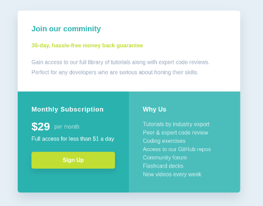

<h1 style= "text-align:center">

Esta es mi solución para el desafío: [Single Price Grid Component.](https://www.frontendmentor.io/challenges/single-price-grid-component-0Q7MGTPWv)

</h1>

## Vista previa



## Vista general

El objetivo fue construir un componente de precios completamente responsive.

La interfaz contiene:

- Introducción a la comunidad.
- Precio mensual.
- Descripción de la suscripción.
- Botón de registro.
- Lista de beneficios.
- Layout mobile-first.
- Distribución en dos columnas para pantallas mayores.

## Enlaces

- Sitio publicado: [Ver proyecto en vivo](https://yovanidosh.github.io/FmSoLuTiOns/challenges/single-price-grid-component-master/)

## Lo que aprendí

En este proyecto aprendí a:

- Construir un componente responsive utilizando CSS Grid.
- Utilizar `grid-template-areas`.
- Crear un layout mobile-first.
- Transformar una estructura vertical en una composición de dos columnas.
- Mantener el mismo HTML entre móvil y escritorio.
- Diseñar un CTA accesible.
- Aplicar estados `:hover`,`:focus-visible`.`:active`.
- Crear sombras suaves.
- Utilizar una lista semántica para presentar beneficios.
- Controlar contraste entre fondos y texto.
- Volver a trabajar con CSS puro después de utilizar Sass y Less.

## Código destacado

### Grid Areas

```css
.pricing-card {
  grid-template-areas:
    "intro intro"
    "subscription why";
}
```

Las áreas permiten distribuir las tres secciones sin modificar el HTML.

```css
.pricing-card__intro {
  grid-area: intro;
}

.pricing-card__subscription {
  grid-area: subscription;
}

.pricing-card__why {
  grid-area: why;
}
```

## Accesibilidad

El proyecto incluye:

- HTML semántico.
- Jerarquía correcta de encabezados.
- Lista semántica.
- Navegación mediante teclado.
- Estados `:focus-visible`.
- CTA interactivo.
- Contraste visual suficiente.
- Mobile-first.
- Responsive Design.
- CSS Grid.
- Media Queries.

## Responsive Design

El proyecto fue construido siguiendo una estrategia mobile-first.

En dispositivos móviles:

- Las tres secciones aparecen apiladas.
- El contenido mantiene una lectura natural.
- El botón ocupa el ancho disponible.

En pantallas mayores:

- La introducción ocupa toda la primera fila.
- La suscripción y la sección Why Us se distribuyen en dos columnas.
- Ambas columnas mantienen proporciones equilibradas.

## Author

- Frontend Mentor: [JOHANX](https://www.frontendmentor.io/profile/YovaniDosh)