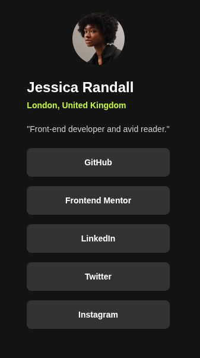

# Social links profile solution

Esta es mi solución para el desafío: [Social links profile challenge on Frontend Mentor](https://www.frontendmentor.io/challenges/social-links-profile-UG32l9m6dQ).

## Vista previa



## Vista general

El objetivo fue construir una tarjeta de perfil social responsive.

La interfaz contiene:

- Avatar del usuario.
- Nombre.
- Ubicación.
- Descripción personal.
- Enlaces a redes sociales.
- Estados hover, focus y active.
- Diseño responsive centrado.

## Enlaces

- Sitio publicado: [Ver proyecto en vivo](https://yovanidosh.github.io/FmSoLuTiOns/challenges/social-links-profile-main/)

## Lo que aprendí

En este proyecto aprendí a:

- Instalar Less mediante npm.
- Configurar Less como dependencia de desarrollo.
- Compilar archivos `.less` a `.css`.
- Automatizar la compilación durante el desarrollo.
- Crear variables utilizando `@`.
- Importar archivos Less utilizando `@import`.
- Organizar estilos en archivos separados.
- Utilizar nesting en Less.
- Utilizar `&` para hacer referencia al selector actual.
- Comprender las diferencias básicas entre Sass y Less.
- Crear una tarjeta centrada con CSS Grid.
- Crear avatares circulares mediante `border-radius: 50%`.
- Utilizar `aspect-ratio`.
- Crear una lista vertical de enlaces.
- Crear transiciones suaves.
- Mantener un diseño responsive sin utilizar media queries innecesarias.
- Evaluar cuándo una dependencia como Bootstrap no aporta valor al proyecto.

## Código destacado

### Variables en Less

```less
@color-background: hsl(0, 0%, 8%);
@color-card: hsl(0, 0%, 12%);
@color-green: hsl(75, 94%, 57%);
```

A diferencia de Sass, que utiliza `$`, Less utiliza `@` para declarar variables.

### Nesting

```less
.profile-card {
  &__links {
    a {
      &:hover,
      &:focus-visible {
        background: @color-green;
        color: @color-background;
      }
    }
  }
}
```

El nesting permite organizar los estilos siguiendo la estructura del componente sin repetir continuamente el selector completo.

### Tarjeta responsive

```less
.profile-card {
  width: min(100%, 24rem);
}
```

Gracias a `min()`, la tarjeta puede adaptarse a pantallas pequeñas sin crecer demasiado en pantallas grandes.

## Accesibilidad

El proyecto incluye:

- HTML semántico.
- Navegación mediante teclado.
- Enlaces mediante `<a>`.
- Estados `:focus-visible`.
- Texto alternativo para el avatar.
- Contraste entre texto y fondo.
- Estados interactivos visibles.
- Mobile-first.
- Responsive Design.
- BEM.
- Less.
- CSS Grid.
- Flexbox.
- npm.

## Responsive Design

El proyecto fue construido siguiendo una estrategia mobile-first.

La tarjeta utiliza un ancho flexible con un límite máximo, permitiendo mantener prácticamente la misma estructura desde dispositivos móviles hasta pantallas de escritorio.

Esto permitió evitar media queries innecesarias.

## Author

- Frontend Mentor: [JOHANX](https://www.frontendmentor.io/profile/YovaniDosh)
