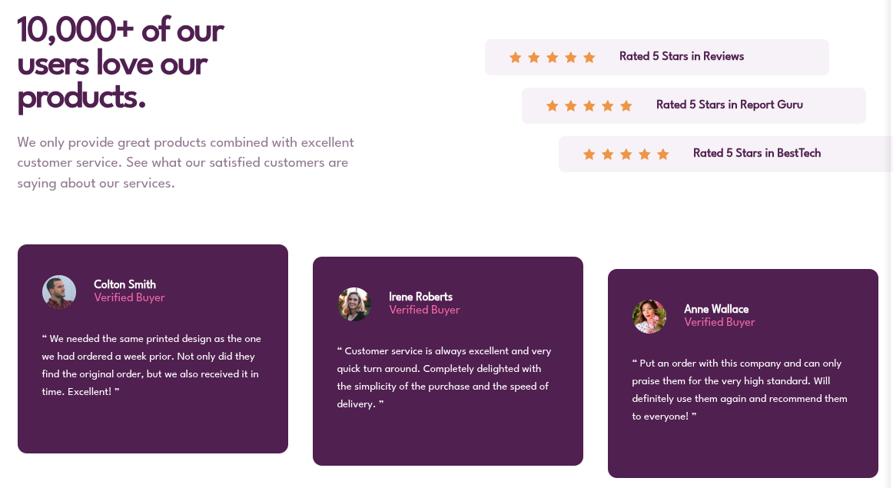

<h1 style="text-align:center">

Esta es mi solución para el desafío: [Social proof section challenge on Frontend Mentor](https://www.frontendmentor.io/challenges/social-proof-section-6e0qTv_bA)

</h1>

## Vista previa



## Vista general

El objetivo fue construir una sección de prueba social responsive basada en valoraciones y testimonios de clientes.

El proyecto contiene:

- Presentación principal.
- Tres valoraciones de cinco estrellas.
- Tres testimonios.
- Avatares de usuarios.
- Tarjetas escalonadas en desktop.
- Diseño responsive.

## Enlaces

- Sitio publicado: [Ver proyecto en vivo](https://yovanidosh.github.io/FmSoLuTiOns/challenges/social-proof-section-master/)

## Lo que aprendí

En este proyecto aprendí a:

- Construir tarjetas reutilizando clases.
- Crear avatares circulares con `border-radius`.
- Utilizar `nth-child()` para seleccionar elementos.
- Desplazar elementos con `transform`.
- Crear composiciones escalonadas.
- Trabajar con `minmax()` en CSS Grid.
- Mantener el contenido semántico con `blockquote`.
- Construir siguiendo una estrategia mobile-first.

## Código destacado

```css
.rating:nth-child(2) {
  margin-left: 3rem;
}

.rating:nth-child(3) {
  margin-left: 6rem;
}

.testimonial:nth-child(2) {
  transform: translateY(1rem);
}

.testimonial:nth-child(3) {
  transform: translateY(2rem);
}
```

Con `nth-child()` pude crear los dos efectos escalonados del diseño sin sacar las tarjetas del flujo normal del documento.

## Accesibilidad

El proyecto incluye:

- HTML semántico.
- Uso de `<main>`, `<section>` y `<article>`.
- Testimonios mediante `<blockquote>`.
- Texto alternativo en los avatares.
- Valoraciones identificadas mediante atributos ARIA.
- Jerarquía de encabezados.

## Responsive Design

El proyecto fue construido mobile-first.

En dispositivos pequeños todos los elementos aparecen en una sola columna. En desktop se utiliza CSS Grid para distribuir la introducción, valoraciones y testimonios.

## Tecnologías utilizadas

- HTML5
- CSS3
- CSS Grid
- Flexbox
- CSS Custom Properties
- BEM
- Media Queries
- Mobile-first

## Author

- Frontend Mentor: [JOHANX](https://www.frontendmentor.io/profile/YovaniDosh)