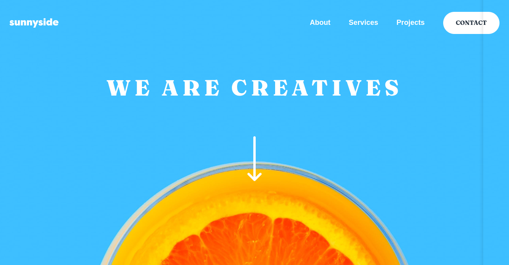

<h1 style="text-align:center">

Esta es mi solución para el reto [Sunnyside Agency Landing Page.](https://www.frontendmentor.io/challenges/sunnyside-agency-landing-page-7yVs3B6ef)

</h1>

## Vista previa

## Link

[Ver proyecto](https://yovanidosh.github.io/FmSoLuTiOns/challenges/sunnyside-agency-landing-page-main/)

## Vista general

El objetivo fue construir una landing page responsive para una agencia creativa, respetando la composición visual en móvil y escritorio.

La interfaz contiene:

- Hero con navegación y llamada visual a continuar.
- Menú móvil controlado con JavaScript.
- Secciones de presentación y servicios.
- Testimonios de clientes.
- Galería responsive mediante `<picture>`.
- Navegación y enlaces sociales en el footer.

## Tecnologías

- HTML5 semántico
- Sass
- CSS3 compilado
- JavaScript
- CSS Grid
- Flexbox
- Imágenes responsive

## Lo que aprendí

- Organizar una landing extensa en secciones semánticas.
- Utilizar Sass para centralizar colores, tipografías y breakpoints.
- Cambiar imágenes según el viewport mediante `<picture>` y `source`.
- Crear un menú móvil accesible sin dependencias externas.
- Sincronizar el estado visual con `aria-expanded`.
- Recuperar el foco al cerrar un menú con `Escape`.

## Accesibilidad

- Navegaciones con nombres accesibles.
- Botón nativo con `aria-expanded` y `aria-controls`.
- Texto del botón actualizado según su estado.
- Cierre mediante enlace o tecla `Escape`.
- Recuperación del foco después del cierre con teclado.
- Estados `:hover` y `:focus-visible`.
- Textos alternativos para imágenes informativas.
- Respeto de `prefers-reduced-motion`.

## Responsive Design

En móvil, el menú aparece como un panel desplegable, las secciones se apilan y la galería utiliza dos columnas. En escritorio, la navegación queda visible, las secciones forman composiciones de dos columnas y la galería muestra cuatro imágenes.

## Autor

- Frontend Mentor: [JOHANX](https://www.frontendmentor.io/profile/YovaniDosh)
