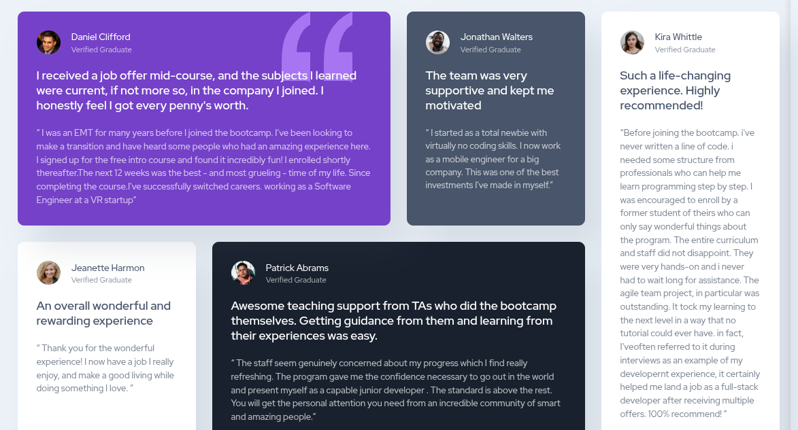

<h1 style="text-align:center">

Esta es mi solución para el desafío: [Testimonials grid section challenge on Frontend Mentor](https://www.frontendmentor.io/challenges/testimonials-grid-section-Nnw6J7Un7)

</h1>

## Vista previa



## Vista general

El objetivo fue construir una sección de testimonios responsive utilizando CSS Grid.

La interfaz contiene:

- Cinco tarjetas de testimonios.
- Avatar, nombre y estado del usuario.
- Testimonio principal y descripción.
- Variantes de color.
- Layout mobile-first.
- Grid asimétrico en escritorio.

## Enlaces

- Sitio publicado: [Ver proyecto en vivo](https://yovanidosh.github.io/FmSoLuTiOns/challenges/testimonials-grid-section-main/)

## Lo que aprendí

En este proyecto aprendí a:

- Construir layouts asimétricos con CSS Grid.
- Utilizar `grid-template-areas`.
- Asignar tarjetas mediante `grid-area`.
- Crear componentes con variantes de color.
- Combinar Grid y Flexbox.
- Crear avatares circulares con `border-radius`.
- Utilizar `aspect-ratio` y `object-fit`.
- Mantener el HTML en el mismo orden entre móvil y escritorio.
- Construir primero una versión mobile-first.
- Utilizar `blockquote` para contenido testimonial.

## Código destacado

### Grid de testimonios

```css
.testimonials {
  grid-template-columns:
    repeat(4, minmax(0, 1fr));

  grid-template-areas:
    "daniel daniel jonathan kira"
    "jeanette patrick patrick kira";
}
```

Este layout permite que algunas tarjetas ocupen varias columnas o filas manteniendo una estructura clara.

## Accesibilidad

El proyecto incluye:

- HTML semántico.
- Uso de `<article>` y `<blockquote>`.
- Texto alternativo en los avatares.
- Jerarquía de encabezados.
- Mobile-first.
- CSS Grid.
- Flexbox.
- Media Queries.

## Responsive Design

En móvil los testimonios se muestran en una sola columna.

En escritorio CSS Grid reorganiza las cinco tarjetas en una composición asimétrica sin modificar el HTML.

## Tecnologías utilizadas

- HTML5
- CSS3
- CSS Grid
- Flexbox
- BEM
- Media Queries
- Mobile-first

## Author

- Frontend Mentor: [JOHANX](https://www.frontendmentor.io/profile/YovaniDosh)